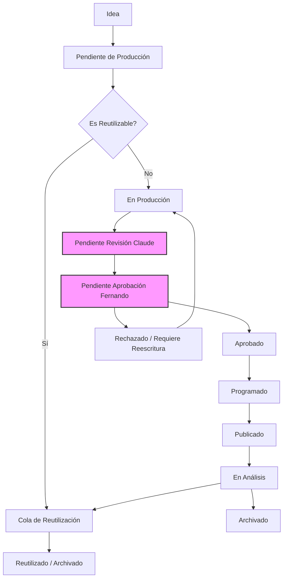

# Arquitectura del Calendario Escalable (1,000+ piezas)

**Propósito:** Definir la arquitectura de metadatos y flujos operativos para gestionar más de 1,000 piezas de contenido, permitiendo filtrado, priorización y publicación controlada mediante Manus y la API de Graph de Meta.
**Estado:** Active
**Fecha de creación:** 2026-07-31
**Última actualización:** 2026-08-15
**Versión:** 1.3
**Autor:** Manus AI
**Documentos relacionados:** `GrowthOS/Integracion_Growth_OS.md`; `Universe Sent Me - Biblia/07 Historias/00 Estándar de Historias.md` (repositorio separado, solo lectura: `iomarketing09-sys/universe-sent-me-1`)

---

## 1. Sistema de Metadatos Estandarizado

Para escalar a 1,000+ piezas, cada idea debe existir como una fila independiente en un sistema relacional o inventario estructurado. La ejecución vigente usa Manus + Meta Graph API: Manus lee la fuente aprobada, valida los bloqueos y utiliza la API de Graph de Meta para programar o publicar en Facebook e Instagram. El estándar de historias de la Biblia (`07 Historias/00 Estándar de Historias.md`) provee la base narrativa, pero el Growth OS requiere metadatos operativos.

### Campos Obligatorios (ID Únicos)

| Campo | Descripción | Formato Requerido | Uso operativo |
| :--- | :--- | :--- | :--- |
| `ID_Pieza` | Identificador único autoincremental | `CNT-####` (Ej: `CNT-001`) | ID principal para Graph API y trazabilidad |
| `Fecha_Creacion` | Fecha de registro de la idea | `YYYY-MM-DD` | Timestamp |
| `Ultima_Modificacion` | Fecha de última actualización | `YYYY-MM-DD` | Timestamp para sincronización |
| `Estado` | Etapa del flujo operativo | Enum (ver sección 2) | Disparador de flujos (Triggers) |

### Campos Narrativos y de Personaje

| Campo | Descripción | Formato Requerido |
| :--- | :--- | :--- |
| `Titulo` | Título o logline de la pieza | Texto corto (< 60 caracteres) |
| `Tipo_Contenido` | Formato del entregable | Enum: `Reel`, `Carrusel`, `Foto`, `Historia`, `Trailer`, `Texto` |
| `Personaje_Principal` | Protagonista | `@char_USM_[nombre]` o `Variable` |
| `Personajes_Secundarios` | Acompañantes | Lista separada por comas o vacío |
| `Lugar` | Escenario | `@loc_USM_[nombre]` o `N/A` |
| `Categoria` | Temática central | Enum: `Humor`, `Filosofía`, `Tarot`, `Magia`, `Narrativa`, `Afilación`, `Educación` |

### Campos Estratégicos y de Growth OS

| Campo | Descripción | Formato Requerido |
| :--- | :--- | :--- |
| `Plataforma` | Destino principal | Enum: `Instagram`, `TikTok`, `YouTube Shorts`, `Facebook`, `Multi` |
| `Hipotesis_ID` | Relación con el banco de hipótesis | `HB-###` o vacío |
| `Objetivo` | Propósito estratégico | Texto corto |
| `Prioridad` | Nivel de urgencia/importancia | Enum: `Alta`, `Media`, `Baja` |
| `Dificultad_Produccion` | Esfuerzo estimado | Enum: `Muy_Baja`, `Baja`, `Media`, `Alta` |
| `Es_Reutilizable` | Flag para reciclar contenido | `Sí` / `No` |
| `Bloqueado_Canon` | ¿Tiene contradicciones de canon? | `Sí` / `No` |
| `Fecha_Ultima_Publicacion` | Fecha de la última vez que se publicó | `YYYY-MM-DD` o vacío |
| `Dias_Desde_Publicacion` | Días transcurridos desde la última publicación | Entero (calculado) |

> **Nota operativa:** La fuente de identidad es `GrowthOS/Content_Inventory.csv`. Antes de programar, Manus debe convertir cada fila aprobada a una orden de publicación y registrarla en `Operations/Research/2026-08-15_Publication_Log.csv`. El calendario Markdown/CSV es una vista de selección, no una segunda fuente maestra. Después de publicar, las métricas y el veredicto se registran en `Operations/Research/2026-08-15_ExperimentLog.csv`.

---

## 2. Máquina de Estados Operativos

Este sistema reemplaza el flujo lineal original por una máquina de estados finita que Manus ejecuta mediante validaciones explícitas y llamadas controladas a la API de Graph de Meta. No se asume que un cambio de estado publique automáticamente: la publicación requiere que la pieza esté aprobada, que el asset sea accesible y que la llamada sea confirmada cuando implique escritura.

### Diagrama de Flujo

### Transiciones Permitidas para Manus y Graph API

> Las transiciones heredadas quedan fuera del flujo vigente; las transiciones actuales se ejecutan mediante validación explícita de Manus y registro de resultados de Meta.

Para evitar errores en la ejecución, Manus solo debe permitir las siguientes transiciones de estado y registrar el resultado de cada llamada a Meta:

1. `Idea` → `Pendiente de Producción`
2. `Pendiente de Producción` → `En Producción` (o `Reutilizado`)
3. `En Producción` → `Pendiente Revisión Claude`
4. `Pendiente Revisión Claude` → `Pendiente Aprobación Fernando`
5. `Pendiente Aprobación Fernando` → `Aprobado`
6. `Pendiente Aprobación Fernando` → `Rechazado / Requiere Reescritura`
7. `Rechazado / Requiere Reescritura` → `En Producción`
8. `Aprobado` → `Programado`
9. `Programado` → `Publicado`
10. `Publicado` → `En Análisis`
11. `En Análisis` → `Archivado` (o `Reutilizado`)

---

## 3. Arquitectura del Calendario Semanal

El calendario no es una tabla estática ni una fuente maestra, sino una **vista filtrada** del inventario total. Para escalar a 1,000+ piezas, el calendario semanal debe generarse dinámicamente basándose en reglas de negocio y sus resultados deben registrarse en el Publication Log.

### Reglas de Asignación Dinámica

Para asignar contenido a los próximos 7 días, el sistema debe aplicar las siguientes prioridades en orden:

1. **Regla de Bloqueo Canon:** Ninguna pieza con `Bloqueado_Canon == Sí` puede entrar al calendario.
2. **Regla de Aprobación:** Solo piezas con `Estado == Aprobado` pueden ser `Programadas`.
3. **Regla de Reutilización (30 días):** Si existe contenido con `Estado == Reutilizado` y `Dificultad_Produccion == Muy_Baja`, priorizar su publicación **solo si han pasado al menos 30 días** desde su `Fecha_Ultima_Publicacion`.
4. **Regla de Equilibrio:** El calendario debe asegurar al menos un 20% de participación por personaje principal (`Universe`, `Wilfred`, `Elara`, `Payaso`, `Ganso`, etc.).
5. **Regla de Formato:** Alternar formatos (no publicar 3 Reels seguidos del mismo personaje en el mismo día).
6. **Regla de Hipótesis:** Priorizar piezas que validen una `Hipotesis_ID` del Growth OS si hay espacio disponible.
7. **Calendario Estratégico:** El calendario NO es una lista fija. Es el resultado de una evaluación estratégica que considera objetivos actuales, experimentos activos, frecuencia, diversidad, personajes, formatos e hipótesis del Growth OS. Nunca llenar el calendario únicamente con contenido reciclado; el contenido nuevo siempre tendrá prioridad cuando aporte mayor valor estratégico.
8. **Regla de Temporalidad:** Clasificar cada pieza como Evergreen, Estacional, Evento o Tendencia. Nunca proponer contenido cuya temporalidad no corresponda con la fecha actual.
9. **Filosofía de Decisión:** Ante varias opciones, seleccionar siempre aquella que: aporte mayor aprendizaje, valide una hipótesis importante, tenga mayor probabilidad de crecimiento, fortalezca el universo narrativo y optimice el tiempo de producción.
10. **Tendencias:** Buscar oportunidades únicamente cuando sean compatibles con la identidad de Universe Sent Me. Las tendencias son herramientas, no objetivos.

### Estructura del Calendario Semanal (Vista)

Las colas `Backlog`, `Reuse Queue`, `Production Queue` y `Approval Queue` también son vistas filtradas de `Content_Inventory.csv`; ninguna debe crear un estado paralelo. La relación entre pieza, publicación y aprendizaje se conserva mediante `ID_Pieza`, `Publicacion_ID` y `Observacion_ID`.

El calendario de 7 días debe proyectar los siguientes campos para la operación diaria:

| Día | Plataforma | Formato | Personaje Principal | Hook / Título | Estado | Responsable | Hipótesis Validada |
| :--- | :--- | :--- | :--- | :--- | :--- | :--- | :--- |
| Lunes | Instagram | Reel | @char_USM_wilfred | El gnomo y el té | Programado | Fernando | HB-001 |
| ... | ... | ... | ... | ... | ... | ... | ... |

---

## 4. Integración vigente con Manus y Graph API

Para que este sistema sea escalable y trazable, Manus leerá la fuente editorial aprobada usando la estructura de metadatos anterior, validará canon, assets, fecha y plataforma, y ejecutará Graph API de Meta. Las automatizaciones heredadas quedan fuera de este flujo; la ruta vigente es Manus + Meta Graph API.

### Flujo vigente de publicación

1. **Validación y preparación:**
   - *Trigger:* Solicitud explícita de Fernando o revisión programada por Manus.
   - *Acción:* Validar `Estado == Aprobado`, `Bloqueado_Canon == No`, asset disponible, caption, plataforma y fecha/hora.

2. **Programación o publicación mediante Graph API:**
   - *Trigger:* Orden de publicación aprobada.
   - *Acción Facebook:* usar el endpoint de Page Feed con `published=false` y `scheduled_publish_time` cuando la fecha esté dentro de la ventana permitida por Meta.
   - *Acción Instagram:* crear el contenedor de media y publicarlo mediante los endpoints de Instagram Content Publishing; cuando no exista programación nativa equivalente, Manus ejecutará la llamada en el momento planificado.
   - *Acción:* registrar ID devuelto, timestamp, permalink o error y actualizar el estado de la pieza.

3. **Registro post-publicación:**
   - *Trigger:* Publicación confirmada o ventana de métricas de 24/72 horas.
   - *Acción:* consultar únicamente métricas nuevas por `Meta_ID`, actualizar `Publication_Log`, agregar la observación al `ExperimentLog` y actualizar el `HypothesisBank`. No volver a descargar el histórico completo.

### Procesos heredados

Los procesos históricos de automatización se conservan únicamente en su documento archivado y no forman parte de esta arquitectura activa. El flujo vigente está definido en las secciones anteriores: validación explícita de Manus, aprobación de Fernando/Claude, publicación mediante Meta Graph API y registro en los ledgers maestros.
