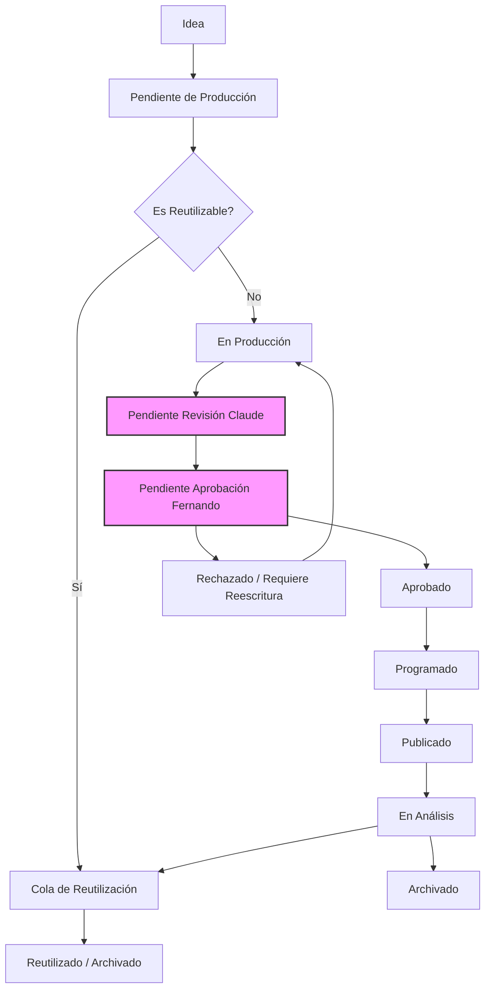

# Arquitectura del Calendario Escalable (1,000+ piezas)

**Propósito:** Definir la arquitectura de metadatos y flujos operativos para gestionar más de 1,000 piezas de contenido, permitiendo filtrado, priorización y automatización con Make.
**Estado:** Active
**Fecha de creación:** 2026-07-31
**Última actualización:** 2026-07-31
**Versión:** 1.0
**Autor:** Manus AI
**Documentos relacionados:** `GrowthOS/Integracion_Growth_OS.md`; `Universe Sent Me - Biblia/07 Historias/00 Estándar de Historias.md` (repositorio separado, solo lectura: `iomarketing09-sys/universe-sent-me-1`)

---

## 1. Sistema de Metadatos Estandarizado

Para escalar a 1,000+ piezas, cada idea debe existir como una fila independiente en un sistema relacional (Google Sheets / Airtable / Base de datos) que alimente a Make. El estándar de historias de la Biblia (`07 Historias/00 Estándar de Historias.md`) provee la base narrativa, pero el Growth OS requiere metadatos operativos.

### Campos Obligatorios (ID Únicos)

| Campo | Descripción | Formato Requerido | Valor para Make |
| :--- | :--- | :--- | :--- |
| `ID_Pieza` | Identificador único autoincremental | `CNT-####` (Ej: `CNT-001`) | ID principal para API/Make |
| `Fecha_Creacion` | Fecha de registro de la idea | `YYYY-MM-DD` | Timestamp |
| `Ultima_Modificacion` | Fecha de última actualización | `YYYY-MM-DD` | Timestamp para sincronización |
| `Estado` | Etapa del flujo operativo | Enum (ver sección 2) | Disparador de flujos (Triggers) |

### Campos Narrativos y de Personaje

| Campo | Descripción | Formato Requerido |
| :--- | :--- | :--- |
| `Titulo` | Título o logline de la pieza | Texto corto (< 60 caracteres) |
| `Tipo_Contenido` | Formato del entregable | Enum: `Reel`, `Carrusel`, `Foto`, `Historia`, `Trailer`, `Texto` |
| `Personaje_Principal` | Protagonista | `@char_USM_[nombre]` o `Variable` |
| `Personajes_Secundarios` | Acompañantes | Lista separada por comas o vacío |
| `Lugar` | Escenario | `@loc_USM_[nombre]` o `N/A` |
| `Categoria` | Temática central | Enum: `Humor`, `Filosofía`, `Tarot`, `Magia`, `Narrativa`, `Afilación`, `Educación` |

### Campos Estratégicos y de Growth OS

| Campo | Descripción | Formato Requerido |
| :--- | :--- | :--- |
| `Plataforma` | Destino principal | Enum: `Instagram`, `TikTok`, `YouTube Shorts`, `Facebook`, `Multi` |
| `Hipotesis_ID` | Relación con el banco de hipótesis | `HB-###` o vacío |
| `Objetivo` | Propósito estratégico | Texto corto |
| `Prioridad` | Nivel de urgencia/importancia | Enum: `Alta`, `Media`, `Baja` |
| `Dificultad_Produccion` | Esfuerzo estimado | Enum: `Muy_Baja`, `Baja`, `Media`, `Alta` |
| `Es_Reutilizable` | Flag para reciclar contenido | `Sí` / `No` |
| `Bloqueado_Canon` | ¿Tiene contradicciones de canon? | `Sí` / `No` |

---

## 2. Máquina de Estados Operativos

Este sistema reemplaza el flujo lineal original por una máquina de estados finita optimizada para automatización (Make). Make puede escuchar cambios en el campo `Estado` y disparar flujos específicos.

### Diagrama de Flujo

### Transiciones Permitidas para Make

Para evitar errores en las automatizaciones, Make solo debe permitir las siguientes transiciones de estado:

1. `Idea` → `Pendiente de Producción`
2. `Pendiente de Producción` → `En Producción` (o `Reutilizado`)
3. `En Producción` → `Pendiente Revisión Claude`
4. `Pendiente Revisión Claude` → `Pendiente Aprobación Fernando`
5. `Pendiente Aprobación Fernando` → `Aprobado`
6. `Pendiente Aprobación Fernando` → `Rechazado / Requiere Reescritura`
7. `Rechazado / Requiere Reescritura` → `En Producción`
8. `Aprobado` → `Programado`
9. `Programado` → `Publicado`
10. `Publicado` → `En Análisis`
11. `En Análisis` → `Archivado` (o `Reutilizado`)

---

## 3. Arquitectura del Calendario Semanal

El calendario no es una tabla estática, sino una **vista filtrada** del inventario total. Para escalar a 1,000+ piezas, el calendario semanal debe generarse dinámicamente basándose en reglas de negocio.

### Reglas de Asignación Dinámica

Para asignar contenido a los próximos 7 días, el sistema debe aplicar las siguientes prioridades en orden:

1. **Regla de Bloqueo Canon:** Ninguna pieza con `Bloqueado_Canon == Sí` puede entrar al calendario.
2. **Regla de Aprobación:** Solo piezas con `Estado == Aprobado` pueden ser `Programadas`.
3. **Regla de Reutilización:** Si existe contenido con `Estado == Reutilizado` y `Dificultad_Produccion == Muy_Baja`, priorizar su publicación.
4. **Regla de Equilibrio:** El calendario debe asegurar al menos un 20% de participación por personaje principal (`Universe`, `Wilfred`, `Elara`, `Payaso`, `Ganso`, etc.).
5. **Regla de Formato:** Alternar formatos (no publicar 3 Reels seguidos del mismo personaje en el mismo día).
6. **Regla de Hipótesis:** Priorizar piezas que validen una `Hipotesis_ID` del Growth OS si hay espacio disponible.

### Estructura del Calendario Semanal (Vista)

El calendario de 7 días debe proyectar los siguientes campos para la operación diaria:

| Día | Plataforma | Formato | Personaje Principal | Hook / Título | Estado | Responsable | Hipótesis Validada |
| :--- | :--- | :--- | :--- | :--- | :--- | :--- | :--- |
| Lunes | Instagram | Reel | @char_USM_wilfred | El gnomo y el té | Programado | Fernando | HB-001 |
| ... | ... | ... | ... | ... | ... | ... | ... |

---

## 4. Integración con Make (Automatización)

Para que este sistema sea escalable y sin fricción, Make se conectará directamente a la base de datos (Google Sheets / Airtable) usando la estructura de metadatos anterior.

### Flujos Recomendados de Make

1. **Flujo de Notificación de Aprobación:**
   - *Trigger:* Fila modificada donde `Estado` cambia de `Pendiente Aprobación Fernando` a `Aprobado`.
   - *Acción:* Enviar notificación a Telegram/Slack/Email informando que `CNT-####` está listo para programación.

2. **Flujo de Generación de Calendario (Semanal):**
   - *Trigger:* Scheduled (cada domingo a las 23:00).
   - *Acción:* Filtrar todas las filas con `Estado == Aprobado` y `Es_Reutilizable == Sí` (prioridad).
   - *Acción:* Generar borrador de la próxima semana respetando la Regla de Equilibrio y Formato.
   - *Acción:* Enviar borrador a Fernando para revisión final.

3. **Flujo de Bloqueo Canon:**
   - *Trigger:* Fila modificada donde `Bloqueado_Canon` cambia de `No` a `Sí`.
   - *Acción:* Si el `Estado` actual es `Programado` o `Publicado`, cambiar forzosamente a `Archivado` y notificar a Fernando.

4. **Flujo de Publicación Programada:**
   - *Trigger:* Fila modificada donde `Estado` cambia de `Aprobado` a `Programado`.
   - *Acción:* Extraer el `ID_Pieza`, leer el documento asociado en el repo (si aplica) y enviar a las herramientas de publicación (API de Instagram/Meta).
