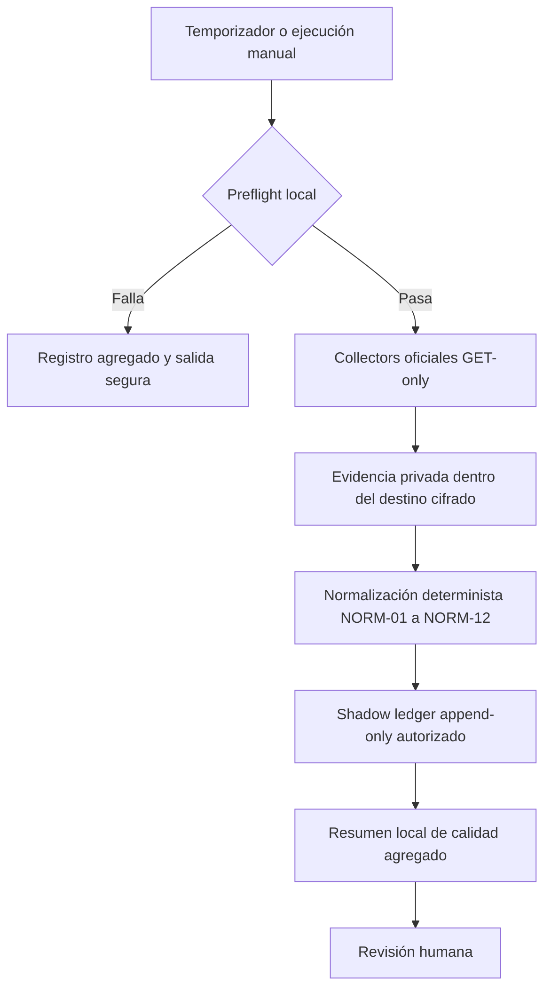

# Hoja de ruta de automatización local segura de métricas

## Propósito y principio rector

Esta hoja de ruta responde qué faltaría para automatizar el sistema de métricas de Universe Sent Me después de resolver el cifrado local. No habilita una tarea programada, no instala servicios, no añade credenciales, no activa el piloto real y no permite salidas externas.

> **Principio rector:** primero se automatiza la recolección determinista local y su control de calidad; después, y solo con gates separados, se puede considerar una salida sanitizada para revisión humana. Nunca se automatiza publicación, comentarios, respuestas, anuncios, mensajes, escritura canónica o exposición de raw.

## Qué se puede preparar y qué permanece bloqueado

| Componente | Se puede preparar ahora | Condición para activarlo |
|---|---|---|
| Collectors oficiales | Diseñar wrapper y pruebas sintéticas. | Volumen/entorno cifrado verificado, credenciales locales y prueba manual supervisada. |
| Normalización NORM-01 a NORM-12 | Ya validada sintéticamente. | Recibir solo evidencia local autorizada bajo G-NORM-4R. |
| Shadow ledger append-only | Contrato y validadores ya disponibles. | G-SEC-2, G-SEC-3 y consentimiento G-NORM-4R aprobados. |
| Scheduler local | Diseñar horario, logs y stop conditions. | Tres ejecuciones supervisadas correctas sin datos fuera del perímetro cifrado. |
| Data Quality | Preparar conteos agregados y fallos. | Salida local sin IDs, raw, valores financieros ni paths. |
| Google Sheets | No. | Gate independiente de salida canónica; no es parte de esta hoja de ruta. |
| OmniRoute | No. | Gate independiente para un brief agregado sanitizado; siempre Draft y revisión humana. |
| Publicación o respuestas | No. | Fuera del alcance del sistema de métricas. |

## Opciones de operación inicial

| Enfoque | Cómo funciona | Ventajas | Límites |
|---|---|---|---|
| **Ejecución manual supervisada** | Fernando abre el volumen cifrado y ejecuta el wrapper local cuando desea una captura. | Menor riesgo, aprendizaje claro y no requiere procesos de fondo. | No es automática; depende de la intervención humana. |
| **Ejecución local programada y cerrada** | Un temporizador local ejecuta el wrapper en un horario fijo solo si el volumen ya está desbloqueado y las validaciones pasan. | Elimina la tarea repetitiva de captura y normalización. | Requiere que Xubuntu esté disponible y que el volumen se haya abierto deliberadamente; falla cerrado si no se cumplen condiciones. |

La opción ligera y recomendada al inicio es la ejecución manual supervisada. La programación local debe llegar solo después de comprobar tres ejecuciones manuales consecutivas con resultados correctos, sin reintentos no controlados ni salida externa.

## Flujo local que se automatizaría

El preflight debe validar, antes de abrir cualquier collector: volumen cifrado disponible, mapper activo, punto de montaje esperado, permisos restrictivos, espacio suficiente, configuración local disponible y modo de ejecución permitido. Si una condición falla, el proceso termina sin crear ledger, sin red y sin salida externa.

## Secuencia de gates

| Gate | Requisito | Evidencia de salida | Si falla |
|---|---|---|---|
| G-SEC-0 | Elegir LUKS integral o volumen dedicado. | Decisión documentada. | Permanecer sintético. |
| G-SEC-1 | Respaldo separado y recuperación probada. | Registro no sensible de validación. | No tocar almacenamiento. |
| G-SEC-2 | Cifrado local verificable: LUKS y mapper correctos. | Comprobación no sensible de cifrado, montaje y permisos. | No crear rutas reales. |
| G-SEC-3 | Operación del volumen: abrir, montar, desmontar y recuperar sin datos reales. | Prueba de operación cerrada. | Corregir el diseño o permanecer sintético. |
| G-NORM-4R | Consentimiento granular: cuatro observaciones no financieras, 30 días, sin cloud. | Aprobación explícita. | No insertar datos reales. |
| G-AUTO-0 | Wrapper local determinista y preflight fail-closed. | Prueba sintética y revisión de código. | Solo ejecución manual existente. |
| G-AUTO-1 | Tres corridas manuales supervisadas correctas. | Resúmenes locales agregados, sin raw. | Investigar manualmente; no programar. |
| G-AUTO-2 | Temporizador local limitado a una frecuencia aprobada y sin reintentos agresivos. | Ejecución programada de prueba sin salida externa. | Volver a manual supervisado. |
| G-OUTPUT-0 | Política específica de salida. | Aprobación separada. | Los resultados permanecen locales. |
| G-LLM-0 | Brief agregado sanitizado y contrato Draft-only. | Aprobación separada. | OmniRoute no recibe nada. |

## Reglas de ejecución programada

| Área | Regla obligatoria |
|---|---|
| Frecuencia inicial | Como máximo una captura diaria por plataforma; la frecuencia exacta se decide antes de G-AUTO-2. |
| Lectura de APIs | Solo collectors oficiales existentes y llamadas GET/read-only con scopes ya aprobados. |
| Credenciales | Permanecen locales; nunca se escriben en el repo, logs, Sheets, Drive, OmniRoute o chat. |
| Evidencia y ledger | Solo dentro del destino cifrado autorizado. No persistir nada si el preflight falla. |
| Reintentos | Sin reintento automático ciego. Un fallo se marca para revisión humana y no provoca escrituras parciales. |
| Idempotencia | Reejecutar el mismo hecho debe producir `duplicate_skip`, no una segunda entrada. |
| Logs | Solo `run_id`, plataforma, estados, conteos agregados, duración y errores clasificados; no IDs, valores, paths, tokens ni raw. |
| Finalización | El volumen se desmonta/cierra según la política aprobada; no se deja un servicio con privilegios abiertos para comodidad. |

## Salidas permitidas por etapa

| Etapa | Salida permitida | Salida prohibida |
|---|---|---|
| Manual supervisada | Resumen local de estado y calidad agregado. | Sheets, Drive, GitHub, modelos, publicación. |
| Programada cerrada | Mismo resumen agregado local; alerta local de fallo si se aprueba. | Sincronización cloud, briefing IA o cambios canónicos. |
| Revisión humana posterior | Documento de decisión o análisis manual basado en agregados permitidos. | Escritura automática de recomendaciones o acciones de cuenta. |
| Gate OmniRoute separado | Un brief sanitizado de alto nivel, con respuesta marcada Draft. | Raw, IDs, hashes, monetización, publicación o escritura en ledger. |

## Criterios de pausa inmediata

La automatización debe detenerse y volver a modo manual si: el volumen no aparece cifrado o montado donde corresponde; se detecta una ruta fuera del perímetro; se produce un error de autenticación o permiso; cambia un scope; aparece una salida externa no aprobada; falla idempotencia; hay error de normalización; se excede el alcance de cuatro observaciones del piloto; o no se puede confirmar la retención de 30 días.

## Secuencia práctica recomendada

1. Resolver primero G-SEC-0 a G-SEC-3 mediante el proyecto de cifrado separado.
2. Renovar y aprobar G-NORM-4R para la muestra real mínima.
3. Realizar tres corridas manuales supervisadas y revisar sus resúmenes agregados.
4. Implementar el wrapper fail-closed y validarlo con fixtures.
5. Autorizar G-AUTO-2 solo para una captura local diaria sin salidas externas.
6. Tras un periodo de estabilidad, decidir por separado si se requiere Sheets o un brief Draft para OmniRoute.

No hay una ruta que permita saltar del modo sintético actual directamente a un sistema completamente autónomo. Cada gate protege una clase distinta de riesgo: almacenamiento, datos, ejecución y salidas.
