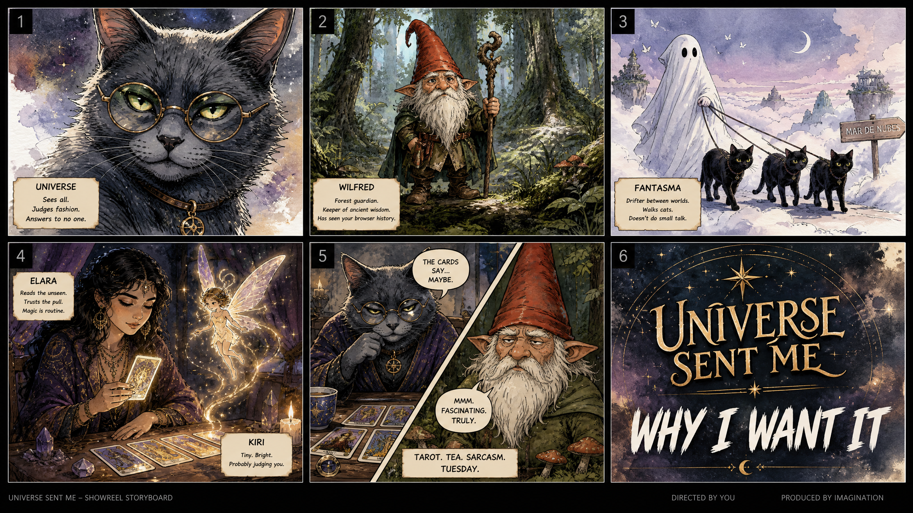

# Blueprint: Showreel Storyboard - Higgsfield Grant

**Propósito:** Visualizar la estructura narrativa y visual del showreel propuesto para la candidatura del Higgsfield Filmmaker Grant.
**Estado:** Active
**Fecha de creación:** 2026-08-02
**Última actualización:** 2026-08-02
**Versión:** 1.0
**Autor:** Manus AI (CGO)
**Documentos relacionados:** `Operations/Research/2026-08-02_Auditoria_Higgsfield_Grant.md`

---

## 1. Concepto Visual
El storyboard utiliza un estilo de historieta/cómic para definir los momentos clave del showreel, asegurando que la transición entre el humor de Universe y la sabiduría seca de Wilfred se sienta orgánica y profesional.

## 2. Storyboard (Imagen)

## 3. Desglose de Paneles

| Panel | Personaje / Escena | Descripción Narrativa | Tono Visual |
| :--- | :--- | :--- | :--- |
| **1** | Universe (Gato) | Close-up cinematográfico. Establece la identidad de marca inmediata. | Alta fidelidad, iluminación suave. |
| **2** | Wilfred (Gnomo) | Guardián en el bosque. Muestra la calidad de los entornos generados. | Bosque místico, niebla, detalle en texturas. |
| **3** | Fantasma | Caminando gatos en el Mar de Nubes. El activo visual más potente para adquisición. | Onírico, surrealista, paleta fría. |
| **4** | Elara y Kiri | Lectura de cartas y hada volando. Muestra efectos de partículas y magia. | Místico, cálido, dinámico. |
| **5** | Universe & Wilfred | Split screen. Contraste entre el tarot y el humor seco. | Dualidad, ritmo rápido. |
| **6** | Cierre | Logotipo "Universe Sent Me" + "Why I Want It". | Tipografía bold, estética de estudio. |

## 4. Próximos Pasos
1. **Selección de Clips:** Identificar los fragmentos de video exactos que corresponden a estos paneles.
2. **Edición:** Montar siguiendo el ritmo de la música folk-orquestal propuesta.
3. **Post-producción:** Asegurar la consistencia de color entre los clips de Higgsfield y Flow.

---
**Nota:** Este documento es el blueprint oficial para la construcción del reel. Cualquier cambio en la estructura debe ser reflejado aquí primero.
