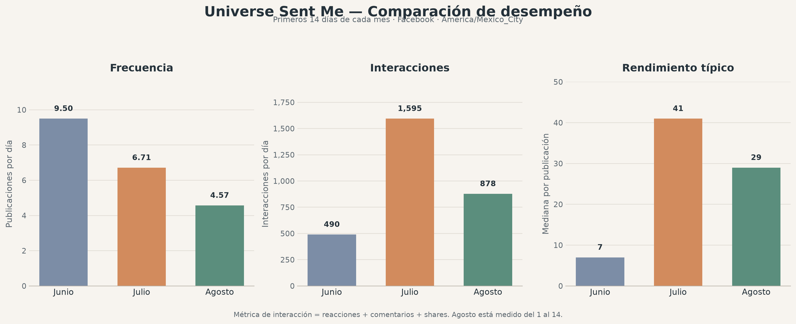

# Comparativo de Desempeño — Junio, Julio y Agosto de 2026

**Propósito:** Determinar si la caída percibida en agosto se explica por una combinación de menor frecuencia, reutilización excesiva de memes de mayo, cambios de horario, cambio de mezcla editorial o menor rendimiento individual de las publicaciones.

**Estado:** Review  
**Fecha de creación:** 2026-08-14  
**Última actualización:** 2026-08-14  
**Versión:** 1.0  
**Autor:** Manus AI  
**Documentos relacionados:** [`GrowthOS/08_00_Metricas_Baseline_Plataformas.md`](../../GrowthOS/08_00_Metricas_Baseline_Plataformas.md), [`Operations/Research/2026-08-08_Reporte_Mensual_Junio_Julio_2026.md`](2026-08-08_Reporte_Mensual_Junio_Julio_2026.md), [`GrowthOS/05_02_Calendario_04_09_Agosto.md`](../../GrowthOS/05_02_Calendario_04_09_Agosto.md), [`GrowthOS/05_03_Calendario_10_16_Agosto.md`](../../GrowthOS/05_03_Calendario_10_16_Agosto.md), [`Operations/Research/2026-08-14_Ciclo_Aprendizaje_Horarios.md`](2026-08-14_Ciclo_Aprendizaje_Horarios.md), [`GrowthOS/Integracion_Growth_OS.md`](../../GrowthOS/Integracion_Growth_OS.md), [`Operations/Research/2026-08-14_Comparativo_Desempeno_Junio_Julio_Agosto_Datos.csv`](2026-08-14_Comparativo_Desempeno_Junio_Julio_Agosto_Datos.csv)

---

## 1. Dictamen ejecutivo

La percepción de que agosto está por debajo de julio es **correcta**, pero la percepción de que agosto está por debajo de junio **no queda respaldada por las interacciones disponibles**. La trayectoria observada en Facebook es más precisa si se describe así: **junio tuvo mucha frecuencia y bajo rendimiento típico por pieza; julio combinó frecuencia todavía alta con un salto fuerte de rendimiento; agosto redujo la frecuencia y también perdió parte del rendimiento típico de julio, aunque sigue por encima de junio por publicación**.

La caída de agosto parece tener **dos causas principales y una tercera causa asociada**. La primera es la reducción objetiva de publicaciones diarias. En los primeros 14 días de cada mes, la frecuencia pasó de 9.50 publicaciones diarias en junio a 6.71 en julio y 4.57 en agosto. La segunda es el cambio de mezcla editorial: entre el 4 y el 9 de agosto el calendario documenta al menos 14 slots de reuse sobre aproximadamente 32 publicaciones observadas, y hubo días como el 5, 6 y 7 de agosto en los que la mayoría de los slots programados eran reutilizados. La tercera es que el cambio de horarios se ejecutó junto con cambios de contenido, personajes y cantidad de publicaciones, por lo que todavía no puede aislarse como causa.

La teoría de que los huecos de publicación redujeron la superficie de descubrimiento es **plausible y compatible con los datos**, pero aún no está demostrada. Lo que sí puede afirmarse es que al bajar de 6.71 a 4.57 publicaciones diarias se redujeron las oportunidades de que una pieza encontrara distribución. No puede afirmarse todavía que Facebook “rellenara” esos huecos con otros contenidos ni que cada post adicional produzca crecimiento incremental; eso requiere datos de alcance, seguidores, impresiones por hora y un diseño de frecuencia controlado.

## 2. Métrica comparable

La comparación usa publicaciones de Facebook extraídas mediante Graph API el 14 de agosto de 2026. La métrica homogénea es `interacciones = reacciones + comentarios + shares`, porque el alcance y las impresiones no están disponibles de manera consistente para este histórico. Las fechas se convierten a `America/Mexico_City` antes de agrupar por mes y día.

Agosto está incompleto: la extracción cubre del 1 al 14 de agosto. Por eso se muestran tanto el mes completo para junio y julio como una comparación limpia de los primeros 14 días de cada mes. El snapshot normalizado contiene 508 publicaciones de junio, julio y agosto y está enlazado en los documentos relacionados.

## 3. Comparación de los primeros 14 días

*Figura 1. Comparación basada en los primeros 14 días de cada mes. Agosto está medido del 1 al 14.*

| Periodo | Publicaciones | Publicaciones/día promedio | Interacciones totales | Interacciones/día promedio | Mediana de interacciones por publicación | Shares / interacciones |
|---|---:|---:|---:|---:|---:|---:|
| Junio 1–14 | 133 | 9.50 | 6,865 | 490.36 | 7 | 20.48% |
| Julio 1–14 | 94 | 6.71 | 22,324 | 1,594.57 | 41 | 23.85% |
| Agosto 1–14 | 64 | 4.57 | 12,293 | 878.07 | 29 | 28.61% |

La lectura central es que **agosto sí cae frente a julio en las dos dimensiones importantes**: hay menos publicaciones y cada publicación tiene una mediana menor de interacciones. Frente a junio, en cambio, agosto tiene menos volumen pero una mediana por publicación cuatro veces superior y más interacciones por día. Por eso no es correcto describir la secuencia como junio fuerte, julio estable y agosto en picada sin especificar qué métrica se está observando.

## 4. Mes completo versus rendimiento típico

| Mes | Publicaciones | Días con publicaciones | Publicaciones/día activo | Interacciones totales | Interacciones/día activo | Mediana por publicación | Promedio por publicación |
|---|---:|---:|---:|---:|---:|---:|---:|
| Junio | 230 | 30 | 7.67 | 18,270 | 609.00 | 10 | 79.43 |
| Julio | 207 | 31 | 6.68 | 68,024 | 2,194.32 | 43 | 328.62 |
| Agosto 1–14 | 64 | 14 | 4.57 | 12,293 | 878.07 | 29 | 192.08 |

Julio no se estabilizó simplemente: en los datos de interacciones disponibles fue el mejor mes de los tres. El reporte mensual independiente confirma la misma dirección con 18,451 interacciones en junio y 68,155 en julio, una diferencia compatible con la extracción actual.[1] Agosto, aun incompleto, se sitúa por debajo de julio en total diario y en mediana por pieza, pero por encima de junio en ambas métricas.

El dato que más apoya la teoría del hueco es la frecuencia: el estudio pasó de un régimen cercano a 7–10 publicaciones diarias a menos de 5 en agosto. Sin embargo, el dato que impide atribuirlo todo a la frecuencia es que la mediana de agosto también bajó de 43 a 29 frente a julio. La caída es, por tanto, **frecuencia reducida más mezcla editorial menos favorable o menos madura**, no únicamente horarios.

## 5. Reutilización de memes de mayo

La documentación del calendario de 4–9 de agosto permite cuantificar el problema de forma parcial. En esos días se observan al menos 14 slots de reuse sobre aproximadamente 32 publicaciones reales del feed, una proporción cercana al 44%. Además, la reutilización estuvo concentrada en días concretos: el 5, 6 y 7 de agosto el calendario asignó tres slots reutilizados de cuatro publicaciones principales; el 8 y 9 de agosto también mantuvo reuse en varios slots.

Esto no demuestra que el reuse sea malo. Los datos históricos de mayo muestran que algunos memes reutilizados tenían un rendimiento extraordinario, por lo que el reuse de piezas top puede ser una herramienta válida de distribución. El problema operativo es distinto: **reutilizar muchos memes sin mantener una proporción suficiente de contenido nuevo reduce la exploración de conceptos, personajes y copys nuevos**. También dificulta saber si una caída proviene de fatiga del público, saturación del formato o simplemente de piezas nuevas menos maduras.

La hipótesis correcta no es “reuse = malo”, sino la siguiente:

> **HB-004 — Saturación por reuse:** Una proporción elevada de memes reutilizados de mayo, especialmente cuando ocupa la mayoría de los slots de un día, reduce el rendimiento mediano de la página por fatiga o menor novedad; el reuse de piezas top puede seguir siendo positivo cuando se limita y se separa por contexto.

HB-004 queda en estado **En prueba**. Para cerrarla se necesita comparar grupos de publicaciones equivalentes: reuse top, reuse medio y contenido nuevo, controlando por horario, personaje y día.

## 6. Cambios de horario y frecuencia

El calendario de 4–9 de agosto trabajaba con una cobertura aproximada de 10:00–10:30, 13:40–16:00, 19:00 y 21:00, con ajustes de 11:00 y 17:00 en algunos días. El calendario de 10–16 amplió y reorganizó las franjas a mañana, tarde y noche, aunque la tabla contiene slots variables y no siempre coincide con la estructura declarada.

El cambio de horario no puede evaluarse separado del volumen. La publicación funciona como una oportunidad de entrar en el feed de usuarios que no siguen la página; si la frecuencia baja, la página tiene menos oportunidades de ser descubierta. Esa lógica es razonable y encaja con la observación de que una pieza viral puede atraer atención hacia otros posts de la página. Pero la evidencia disponible solo prueba una reducción de oportunidades, no el mecanismo algorítmico específico.

La hipótesis de frecuencia y superficie de descubrimiento debe registrarse así:

> **HB-005 — Superficie de descubrimiento:** Mantener una frecuencia suficiente de publicaciones de calidad aumenta las oportunidades de distribución y descubrimiento entre no seguidores; reducir demasiado la frecuencia puede disminuir el rendimiento total diario aunque mejore la calidad media de algunas piezas.

HB-005 queda en estado **En prueba**. La métrica primaria será `interacciones_totales_por_día`; la métrica secundaria será `mediana_de_interacciones_por_publicación`. Si aumenta la frecuencia y sube el total diario pero cae la mediana, habrá evidencia de alcance agregado con posible canibalización. Si suben ambos, la frecuencia está aportando valor neto. Si no sube ninguno, publicar más no está resolviendo el problema.

## 7. Teoría de que una audiencia más grande requiere menos publicaciones

La teoría es estratégicamente razonable, pero todavía no puede validarse con el histórico disponible. La API devolvió el conteo actual de la Página —4,669 seguidores—, pero la métrica histórica diaria de seguidores solicitada no fue válida en el endpoint consultado. Sin una serie de seguidores por fecha no se puede saber si la página estaba creciendo, estancada o perdiendo seguidores durante los cambios.

La teoría debe tratarse como una regla condicional, no como una conclusión: cuando el alcance recurrente entre seguidores y no seguidores sea suficientemente alto, puede reducirse la frecuencia sin perder oportunidades de distribución. Antes de llegar a ese punto, una frecuencia menor puede tener un costo mayor porque cada publicación viral tiene menos oportunidades de aparecer.

## 8. Diagnóstico provisional

| Factor | Evidencia actual | Peso provisional | Conclusión |
|---|---|---:|---|
| Menor frecuencia | 9.50 → 6.71 → 4.57 publicaciones/día en primeros 14 días | Alto | Es la señal más clara de menor superficie de descubrimiento |
| Reuse concentrado | ≥14 reuse en 4–9 agosto; mayoría de slots en varios días | Medio-alto | Compatible con fatiga y menor exploración, no prueba causalidad |
| Cambio de horarios | Medianas históricas y nuevos slots, pero intervención mezclada | Medio | Puede contribuir, todavía no aislado |
| Calidad de contenido nuevo | Agosto cambia personajes y copys; mediana baja frente a julio | Medio-alto | Probable cofactor; requiere etiquetado de tipo de contenido |
| Menor audiencia | Solo existe conteo actual; no hay serie histórica | Desconocido | Teoría no comprobable todavía |
| Canibalización por exceso de posts | No hay métricas por impresión/alcance consistentes | Desconocido | Debe medirse antes de reducir o aumentar frecuencia de forma permanente |

El diagnóstico más defendible es: **agosto no está en picada respecto a junio, pero sí retrocede frente a julio; el retroceso parece explicarse principalmente por menos publicaciones y, en segundo lugar, por una mezcla editorial menos favorable y un uso concentrado de reuse. El horario probablemente influye, pero los datos actuales no permiten asignarle la mayor parte de la caída.**

## 9. Próximo experimento

No se debe elegir todavía un horario definitivo. El siguiente ciclo debe mantener una frecuencia suficiente —por ejemplo, cinco a siete posts de Facebook por día durante dos semanas— y etiquetar cada pieza como `Nueva`, `Reuse_Top` o `Reuse_NoTop`. Dentro de esa frecuencia se deben repartir horarios en tres bloques: mañana, tarde y noche, evitando cambiar a la vez el tipo de contenido y el slot.

El `ExperimentLog` debe registrar por día el número de publicaciones, interacciones totales, mediana por publicación, shares, piezas nuevas, piezas reuse y publicaciones que superaron la mediana de la cuenta. La decisión posterior será una comparación entre rendimiento total de la página y rendimiento típico por pieza, no una sola cifra.

### Referencias

[1]: 2026-08-08_Reporte_Mensual_Junio_Julio_2026.md — Reporte mensual con agregados históricos de junio y julio.
[2]: ../../GrowthOS/08_00_Metricas_Baseline_Plataformas.md — Baseline de métricas de Facebook e Instagram.
[3]: ../../GrowthOS/05_02_Calendario_04_09_Agosto.md — Calendario con el detalle de reuse y slots del 4–9 de agosto.
[4]: ../../GrowthOS/05_03_Calendario_10_16_Agosto.md — Calendario con el cambio de estrategia y horarios del 10–16 de agosto.
[5]: 2026-08-14_Ciclo_Aprendizaje_Horarios.md — Reconstrucción inicial del ciclo de aprendizaje de horarios.
[6]: 2026-08-14_Comparativo_Desempeno_Junio_Julio_Agosto_Datos.csv — Snapshot normalizado de publicaciones extraído de Graph API.
