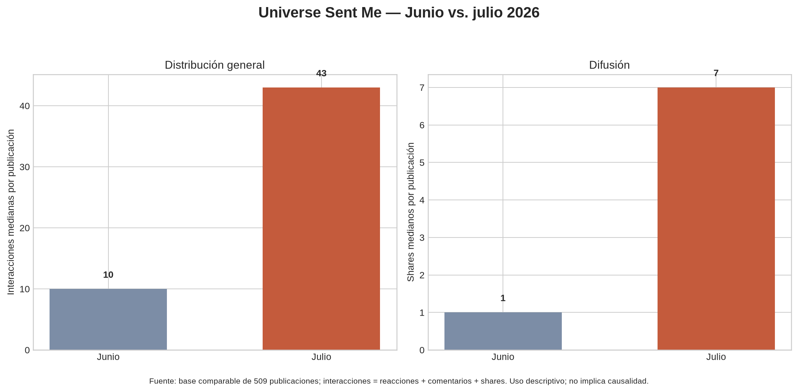

# Síntesis histórica de crecimiento — junio y julio 2026

## Resumen ejecutivo

La observación del usuario es correcta: **julio tuvo un rendimiento claramente superior al de junio y a la cohorte activa de agosto en la mayoría de los cortes comparables disponibles**. Sin embargo, la explicación no es simplemente “publicar más emojis” ni “usar más Universe”. Julio publicó aproximadamente 10% menos piezas que junio en la base analítica comparable, pero alcanzó 3.72 veces sus interacciones totales; además, su mediana por publicación fue 4.3 veces mayor y su mediana de shares fue siete veces mayor.

La señal más útil para agosto es una combinación de **situación fácilmente transferible, remate legible, potencial de compartir o etiquetar y captions de baja fricción**. El copy mínimo aparece en los mejores casos, pero julio también mejoró en publicaciones no mínimas; por ello debe tratarse como una variable experimental, no como una explicación universal.

> Junio y julio no deben convertirse automáticamente en “reglas de calendario”. Deben convertirse en una biblioteca de hipótesis y formatos que la cohorte de agosto pruebe de manera controlada.

## 1. Qué datos son comparables y cuáles son canónicos

Hay dos capas que deben mantenerse separadas. La base analítica comparable de 509 publicaciones usa la misma definición para junio y julio: `interacciones = reacciones + comentarios + shares`. En esa capa aparecen 230 publicaciones de junio y 207 de julio. Es útil para comparar distribuciones, copy y horarios, pero no reemplaza la vista histórica consolidada de junio.

La fuente histórica consolidada de junio contiene 172 publicaciones lógicas y 17,334 interacciones después de consolidar cinco duplicados. El reporte mensual de Windsor.ai registra cifras ligeramente distintas porque usa otra extracción y otra regla de inclusión. Para el análisis de tendencia se usa la base homogénea; para rankings históricos y atribución de junio se conserva la vista consolidada. Julio mantiene 207 publicaciones en ambas referencias, con una diferencia pequeña en el total de interacciones por extracción.

| Capa | Junio | Julio | Uso |
|---|---:|---:|---|
| Base comparable post a post | 230 posts; 18,270 interacciones | 207 posts; 68,024 interacciones | Comparar distribución, copy y horarios |
| Fuente histórica consolidada | 172 posts lógicos; 17,334 interacciones | 207 posts mensuales; 68,155 en reporte Windsor | Rankings, auditoría y atribución |
| Taxonomía individual enriquecida | 172 filas taxonómicas, con limitaciones de identidad | 6 top posts reconciliados visualmente | Analizar contenido, no medir todo el mes por personajes |
| Agosto | Cohortes activas y snapshots | No equivalente lifetime | Operación y experimentación actuales |

## 2. Magnitud de la diferencia entre junio y julio

| Métrica en base homogénea | Junio | Julio | Cambio julio vs. junio |
|---|---:|---:|---:|
| Publicaciones | 230 | 207 | -10.0% |
| Interacciones totales | 18,270 | 68,024 | +272.3% |
| Mediana de interacciones por post | 10 | 43 | +330.0% |
| Mediana de shares por post | 1 | 7 | +600.0% |
| Percentil 90 de interacciones | 171 | 677 | +296.0% |
| Comentarios medianos | 1 | 2 | +100.0% |

El dato más importante no es únicamente el total mensual: **la mediana también subió**. Esto indica que julio no fue solo un mes con uno o dos outliers enormes; hubo una distribución general más fuerte. Aun así, la media sigue siendo sensible a los grandes posts de julio y debe leerse junto con la mediana y el percentil 90.

## 3. Qué funcionó en junio

Junio ya contenía señales que después se volvieron muy visibles en julio. Entre sus mejores publicaciones aparecen `😎` con 924 interacciones y 214 shares, `🤡` con 785 y 263 shares, `😏` con 1,069 y 200 shares, además de piezas como “El gato: 😧” y “a ver... a ver... 🤨”. También hubo una pieza no mínima de alto rendimiento: “Me da miedo ser el malo de la historia...” alcanzó 1,308 interacciones y 392 shares.

La lección de junio no debe reducirse a emoji. Junio muestra al menos tres familias reutilizables: reacción mínima con alta compartibilidad, humor ácido/relatable con situación concreta y piezas de personaje o mundo que pueden generar identidad aunque no sean las más difundidas. El histórico detallado de junio sigue sobrerrepresentando a Universe por filenames, por lo que las conclusiones de personaje deben ser prudentes.

## 4. Qué funcionó en julio

Julio amplificó la difusión. Sus diez mejores casos de la base comparable incluyen `🫣🫣` con 5,482 interacciones y 2,312 shares, `😐` con 3,993 y 1,449 shares, `🥴🤯 escucho borroso...` con 3,913 y 1,521 shares, `😮‍💨` con 3,740 y 904 shares, y “No es desinterés...” de Fantasma con 3,726 y 1,341 shares.

La publicación `🥴🤯 escucho borroso...` destaca por combinar difusión y conversación: tuvo 102 comentarios además de 1,521 shares. Eso la convierte en un caso distinto de los posts puramente mínimos. El aprendizaje práctico es que julio tuvo dos motores simultáneos: **difusión de baja fricción** y **situaciones lo bastante claras para activar identificación, comentarios o etiquetas**.

La taxonomía visual de los seis top posts de julio también corrige una posible lectura errónea. Solo dos casos muestran claramente a Universe, uno muestra a Fantasma y tres no permiten asignar un personaje canónico concreto. El rendimiento de julio, por tanto, no demuestra que Universe como personaje aislado sea la causa. Demuestra mejor el valor de la situación reconocible, el remate y la difusión social.

## 5. Copy mínimo: señal fuerte, pero no explicación completa

En la base comparable, el copy marcado como mínimo representa 53.5% de las publicaciones de junio y 24.6% de las de julio. A pesar de que fue menos frecuente en julio, su mediana subió de 11 a 66 interacciones y de 1 a 12 shares. En las publicaciones no mínimas de julio la mediana también subió: 41.5 interacciones y 6.5 shares, frente a 10 y 1 en junio.

La lectura correcta es que **julio mejoró tanto en copy mínimo como en copy no mínimo**. El copy mínimo parece una palanca de baja fricción que puede amplificar una imagen ya clara, pero no sustituye la calidad del concepto. Un caption mínimo encima de una situación débil no debe considerarse equivalente a `🫣🫣`, `😐` o `😮‍💨` en los mejores casos históricos.

| Tratamiento histórico aproximado | Junio | Julio | Decisión para agosto |
|---|---:|---:|---|
| Copy mínimo | 123 posts; mediana 11 interacciones / 1 share | 51 posts; mediana 66 / 12 | Mantener como celda experimental de baja fricción |
| Copy no mínimo | 107 posts; mediana 10 / 1 | 156 posts; mediana 41.5 / 6.5 | No descartarlo; probar situaciones claras y captions de refuerzo |
| Caption conversacional verificable | No hay clasificación histórica completa | No hay clasificación completa | Diseñar y registrar explícitamente en nuevas pruebas |

## 6. Horarios y días: reutilizar ventanas, no declarar leyes

La base comparable sugiere que julio tuvo sus mejores medianas en varias ventanas de tarde-noche. La hora 18 alcanzó una mediana de 136 interacciones, la hora 15 una mediana de 68, la hora 16 una mediana de 54, la hora 9 una mediana de 51 y la hora 20 una mediana de 46. La hora 22 tuvo la media más alta del mes, pero también está influida por sus outliers; su mediana fue 107.

Junio tiene otra forma de concentración. En el agregado por horario, las franjas 11, 21 y 19 concentraron altos promedios y shares totales, pero las medias son sensibles a pocos casos fuertes. La base post a post coloca las medianas más útiles de junio en 20, 22, 18 y 10, aunque con menos escala que julio.

Los días de julio más fuertes por mediana fueron sábado, jueves, viernes y lunes; por media, sábado y lunes destacaron. En junio el domingo muestra la media más alta, pero su mediana es baja, lo que confirma la influencia de outliers. La recomendación es usar **18:00–22:00 como corredor de prueba principal**, con una celda secundaria en 14:00–16:00, sin eliminar la variación de días.

## 7. Biblioteca reutilizable para agosto

El Growth OS puede aprovechar junio y julio como una biblioteca de tratamientos, no como un calendario copiado. La primera familia es `Difusión_Minimal`: imagen con remate fuerte y caption mínimo, uno o dos emojis o una frase muy breve. La segunda es `Relatable_Social`: situación concreta y transferible, con caption corto de refuerzo. La tercera es `Conversación_Relacional`: dos voces, pregunta/respuesta o tensión social, con caption conversacional cuando se busque comentario. La cuarta es `Ácido_Interpersonal`: conflicto o ironía reconocible, separada de humor sexual y de observacional oscuro. La quinta es `Personaje_Marcador`: personaje visualmente confirmado con situación comprensible; no asignar personaje desde filename.

Cada publicación futura debería registrar `Hypothesis_ID`, `Cell_ID`, `Caption_Treatment`, `Personaje_Principal_Observado`, `Tipo_Humor`, `Potencial_Etiquetado`, `Hora_Test` y `Experiment_ID`. Los treatments `caption_minimo`, `caption_refuerzo` y `caption_conversacional` deben distribuirse de forma explícita, evitando que una celda parezca funcionar solo porque recibió el mejor horario o el mejor personaje.

| Celda para agosto | Tratamiento recomendado | Métrica primaria | Control necesario |
|---|---|---|---|
| Difusión mínima | `caption_minimo` | Shares por publicación | Imagen no mínima con mismo tipo de remate |
| Relatable social | `caption_refuerzo` | Shares y etiquetas/comentarios | Misma claridad sin pregunta final |
| Conversación relacional | `caption_conversacional` | Comentarios raíz y replies | Caption corto no conversacional |
| Ácido interpersonal | `caption_refuerzo` o `caption_conversacional` | Shares y comentarios | No mezclar sexual explícito ni sarcasmo oscuro |
| Personaje con marcador | Cualquiera, balanceado | Mediana de interacciones por rol | Personaje visual confirmado, no filename |

## 8. Límites frente a agosto

Agosto se está midiendo en cohortes activas, snapshots y ventanas operativas distintas. No se debe decir que una pieza de agosto “perdió” frente a una pieza histórica lifetime sin especificar la ventana y el momento de extracción. La comparación válida es de dirección y distribución, no una sustitución de P0 por datos históricos.

El rendimiento inferior de agosto puede tener varias explicaciones no excluyentes: menor madurez de la página en determinados cortes, saturación por reuse, mezcla de publicaciones nuevas y reutilizadas, distribución de horarios, diferente composición de formatos o menor presencia de piezas de difusión mínima. Estas son hipótesis operativas; no se debe canonizar ninguna sin una cohorte comparable.

## Recomendación CGO

Sí conviene aprovechar toda la información de junio y julio. La acción correcta no es copiar sus posts ni convertir julio en una regla absoluta, sino utilizar ambos meses para diseñar una **biblioteca de pruebas de agosto**. La primera ola debería balancear difusión mínima, relatable social y conversación relacional, concentrando parte de las pruebas en 18:00–22:00 y manteniendo un control en 14:00–16:00.

La fuente histórica queda suficientemente integrada para alimentar briefs, taxonomía y experimentos. No hace falta ampliar masivamente la reconciliación individual de todos los posts de julio antes de usar estos aprendizajes; sí conviene ampliar casos individuales cuando una pieza pueda responder una pregunta concreta sobre shares, comentarios, etiquetabilidad o personaje.

## 9. Auditoría de cobertura y partes todavía analizables

La base histórica está suficientemente integrada para orientar el Growth OS, pero no está igualmente completa en todas sus capas. La diferencia principal es esta: **junio tiene una cobertura individual amplia pero una taxonomía visual todavía parcial; julio tiene agregados completos y solo seis publicaciones reconciliadas individualmente**. Por tanto, sí existen partes de junio y julio que pueden ampliarse, aunque no conviene reabrir la recopilación básica ni intentar reconstruir ventanas históricas de 24/72 horas.

| Capa de conocimiento | Junio | Julio | Brecha real | Prioridad |
|---|---|---|---|---|
| Agregado comparable de rendimiento | 230 publicaciones en la base homogénea | 207 publicaciones | No existe una brecha mensual crítica | Cerrada |
| Vista histórica consolidada | 172 publicaciones lógicas y 17,334 interacciones | 207 publicaciones en la referencia mensual | Mantener ambas capas separadas por diferencias de extracción | Cerrada con control |
| Reconciliación individual asset → Meta → CNT | 172 relaciones confirmadas; 171 con `Asset_Ref`; 17 registros sin referencia utilizable y 58 casos en cola sin match | 6 publicaciones reconciliadas de 207; 201 permanecen solo en la capa comparable | Julio necesita ampliación individual; junio solo requiere resolver reservas si una pregunta lo justifica | Julio P1; junio P2/P1 bajo demanda |
| Taxonomía editorial | 172 filas con campos normalizados, pero la identidad visual fue revisada solo en un subconjunto reducido y `Universe` domina por convención de filename | 6 de 6 top posts revisados visualmente | Falta una muestra visual ampliada, especialmente en julio y en los casos de junio con alto share | P1 analítico |
| Celdas narrativas comparables | Microhistoria estricta `n=1`; transformación `n=2`; observacional `n=3`; diálogo ácido `n=2`; autodesprecio/antihéroe `n=2` | Las celdas usan principalmente evidencia histórica combinada de ambos meses | Solo observacional alcanza señal preliminar; las otras celdas aún necesitan casos comparables | P1 selectivo |
| Caption histórico | Clasificación parcial; la matriz comparable usa `Needs_Reconstruction` cuando no hay fuente verificable | La muestra individual de seis top no permite comparar tratamientos | No existe base suficiente para atribuir rendimiento al caption mínimo, de refuerzo o conversacional por sí solo | P2 / no inferir causalidad |
| Comentarios y conversación | 72 comentarios recuperados en cinco posts prioritarios; no es una lectura de todo junio | Análisis de comentarios concentrado en los seis top posts integrados | Puede ampliarse para shares altos con conversación inusual, no como extracción masiva | P2 bajo pregunta concreta |
| Horarios y días | Agregados completos; media mañana y noche temprana aparecen como ventanas prioritarias, con sensibilidad a outliers | Agregados completos; tarde-noche y algunos días fuertes, también sensibles a outliers | Falta cruzar horario con celdas visuales comparables, no volver a calcular promedios generales | P1 si se cruza con contenido |

### Qué conviene ampliar primero

El siguiente lote histórico de mayor valor es una **ampliación individual de julio**, no una nueva auditoría mensual. Julio tiene 207 publicaciones en la base comparable, pero únicamente seis disponen actualmente de asset confirmado, Drive ID, Meta ID y CNT editorial. La ampliación debería seleccionar un lote pequeño y ordenado por una pregunta concreta: primero publicaciones con muchos shares que no sean los seis top ya integrados; después publicaciones con comentarios altos; finalmente casos que puedan completar las celdas de microhistoria, transformación, diálogo ácido o autodesprecio/antihéroe. Cada fila debe pasar por evidencia visual antes de recibir una clasificación o CNT.

La segunda ampliación recomendable es **visual y comparativa**, utilizando junio y julio juntos, pero no mezclando categorías incompatibles. Las metas mínimas siguen siendo: dos casos adicionales para microhistoria estricta, uno para transformación de Universe, uno para diálogo ácido y uno para autodesprecio/antihéroe. Humor observacional ya tiene `n=3`, aunque la mediana de 36 interacciones frente a una media de 151 muestra sensibilidad al caso de 393 interacciones; debe conservarse como señal preliminar y reportarse con y sin ese caso.

La tercera ampliación, de menor prioridad, es la capa de conversación. Puede estudiarse un lote reducido de publicaciones que combinen shares altos con comentarios altos o con replies anidados. No tiene sentido extraer comentarios de las 437 publicaciones históricas restantes si no existe una decisión de community management asociada. `CNT-068` debe mantenerse como caso de difusión con conversación no verificable en la extracción actual, no como evidencia de ausencia de conversación.

### Qué no debe ampliarse ahora

No conviene intentar reconstruir las ventanas históricas exactas de 24/72 horas: la evidencia disponible no permite hacerlo de forma válida y el Growth OS ya separa lifetime histórico de los cortes operativos de agosto. Tampoco conviene crear CNT para los 201 posts de julio pendientes ni para los 58 casos de junio sin match únicamente para mejorar el conteo. La creación de CNT debe seguir subordinada a una relación Meta/Drive verificable y a un uso futuro concreto.

Tampoco debe ampliarse la comparación por personaje sin revisión visual. En junio, 167 de las filas taxonómicas llevan `Universe` como etiqueta de inventario y en julio tres de los seis top posts no permiten asignar un personaje canónico concreto; esa distribución no puede sostener un ranking de personajes. El análisis debe priorizar rol narrativo, estructura del chiste, emoción legible y potencial de compartir/etiquetar.

### Decisión recomendada

La auditoría queda clasificada como **cobertura histórica suficiente para operación, con ampliación analítica selectiva pendiente**. Si Fernando aprueba continuar, el orden recomendado es: **(1) julio individual por shares y comentarios; (2) completar las celdas comparables que siguen bajo `n=3`; (3) solo después ampliar comentarios o reservas de junio cuando respondan una pregunta concreta**. Esta secuencia aprovecha la mayor señal de julio sin reabrir trabajo de inventario que ya está cerrado.

## Referencias

[1]: `2026-08-14_Comparativo_Desempeno_Junio_Julio_Agosto_Datos.csv` — base comparable de 509 publicaciones.
[2]: `2026-08-20_Comparativo_Crecimiento_Junio_Julio.json` — cálculo reproducible de distribuciones, copy y horarios.
[3]: `2026-08-08_Reporte_Mensual_Junio_Julio_2026.md` — agregados mensuales extraídos de Windsor.ai.
[4]: `2026-08-17_Junio_Analisis_Base.csv` — base taxonómica detallada de junio.
[5]: `2026-08-17_Julio_Analisis_Taxonomia.csv` — muestra de seis top posts de julio.
[6]: `2026-08-17_Analisis_Julio_Taxonomia_y_Pendientes_Growth_OS.md` — estado y limitaciones de la integración individual de julio.
[7]: `2026-08-14_Analisis_Copys_Rendimiento.md` — buckets históricos de copy mínimo, frase corta y conversación.
[8]: `2026-08-20_Expansion_Celdas_Comparables_Candidatos.csv` — celdas comparables y cautelas de identidad.

[9]: `Operations/Research/2026-08-17_Reporte_Final_Recopilacion_Junio.md` — cobertura individual y reservas de reconciliación de junio.
[10]: `Operations/Research/2026-08-17_Analisis_Julio_Taxonomia_y_Pendientes_Growth_OS.md` — cobertura individual y brechas de julio.
[11]: `Operations/Research/2026-08-20_Propuesta_Expansion_Celdas_Comparables.md` — umbrales y estado de las cinco celdas comparables.
[12]: `Operations/Research/2026-08-20_Expansion_Round2_Combined_Summary.json` — medianas, sensibilidad a outliers y tratamientos de caption.
