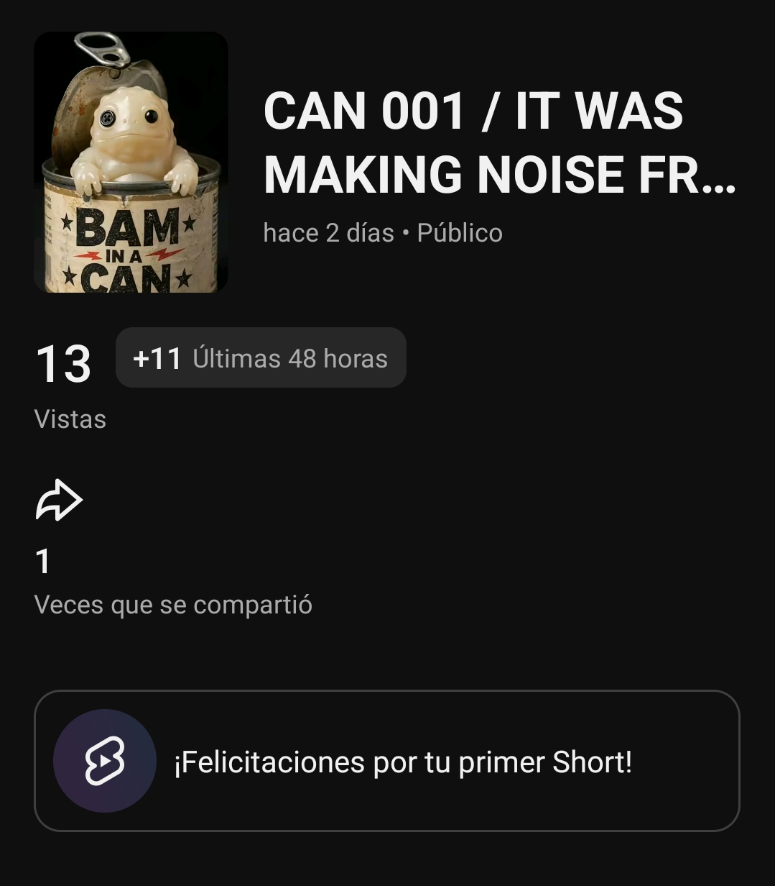

# Bam in a Can — CAN-001: snapshot temprano consolidado

## Alcance del corte

El corte se inició a las **22:51:21 CDT del 21 de agosto de 2026**, aproximadamente 3 h 47 min después de TikTok, 3 h 31 min después de Instagram Reels y 3 h 1 min después de YouTube Shorts. Las métricas son un snapshot temprano de disponibilidad pública; no permiten atribuir un resultado al audio ni comparar plataformas como si compartieran la misma edad, algoritmo o definición de interacción.

## Observaciones públicas iniciales

| Plataforma | Edad en el corte | Datos públicos visibles | Campos no expuestos / límite |
|---|---:|---|---|
| TikTok | 3 h 47 min 01 s | El permalink canónico cargó bajo `@bam_in_a_can`. | La vista pública devolvió una barrera de inicio de sesión y no mostró reproducciones, likes, comentarios, compartidos ni guardados. |
| Instagram Reels | 3 h 31 min 21 s | 1 like; 0 comentarios visibles; caption y disclosure presentes. | Reproducciones, compartidos y guardados no se exponen públicamente en esta vista sin autenticación. |
| YouTube Shorts | 3 h 01 min 21 s | 0 likes visibles; el Short se muestra en `@Bam_in_a_can`. | Reproducciones, comentarios, compartidos y retención no se exponen en la vista pública recuperada. |

## Regla de lectura

Un valor público ausente se registra como **no disponible**, nunca como cero. Los únicos conteos observables en esta etapa son 1 like público en Instagram y 0 likes públicos en YouTube. No se infiere retención, alcance, compartidos, guardados o performance relativo a partir de esos datos aislados.

## Corrección autenticada — Windsor.ai

Windsor.ai devolvió registros autenticados para TikTok e Instagram aproximadamente ocho minutos después de la revisión pública. Los tiempos `data_fetched_at` se entregan en UTC; se convirtieron a CDT para expresar la edad de las publicaciones. La consulta de YouTube no devolvió todavía una fila para el Short publicado el mismo día, por lo que su ausencia es de **indexación pendiente** y no una métrica de cero.

| Plataforma | Fuente y edad del post | Métricas recuperadas | Lectura de calidad de datos |
|---|---:|---|---|
| TikTok | Windsor.ai, `data_fetched_at` 03:59:22 UTC / 22:59:22 CDT; 3 h 55 min 02 s | 93 views; 0 likes; 0 comentarios; 0 shares; 0 favoritos; avg. watch time 2.15 s; full-watched rate 6 %. | El alcance devuelve 0 pese a tener views; no se usa para tasa de engagement. El avg. watch representa 30.71 % de un clip de 7 s. |
| Instagram Reels | Windsor.ai, `data_fetched_at` 03:59:54 UTC / 22:59:54 CDT; 3 h 39 min 54 s | 198 views; reach 161; 1 like; 0 comentarios; 0 shares; 0 saves; 1 interacción; avg. watch time 3.744 s; total watch 602.838 s. | El avg. watch representa 53.48 % de 7 s. La tasa de interacción es 0.62 % sobre reach y 0.50 % sobre views. |
| YouTube Shorts | Windsor.ai consultado cerca de 23:00 CDT; 3 h 10 min 39 s | Sin fila devuelta para `iuHT1kN0Uow`. | El conector todavía no indexa este Short de la fecha actual; no registrar 0 views ni 0 likes como dato autenticado. |

### Reintento de indexación — 22 de agosto

Con Windsor.ai habilitado y el conector de YouTube confirmado, se repitió la consulta a las **14:14:25 CDT** del 22 de agosto, cuando el Short tenía **18 h 24 min 25 s** de antigüedad. La consulta de video y de metadatos siguió devolviendo una lista vacía para el canal `baminacan@gmail.com`; el conector no mostró opciones adicionales ni filtros de fecha específicos que modificaran ese resultado. Por tanto, el Short continúa publicado y visible, pero **no está disponible aún como fila autenticada dentro de Windsor.ai**. Esta condición se conserva como atraso de indexación, no como cero rendimiento.

### Evidencia directa de YouTube Studio

Fernando aportó una captura de YouTube Studio del Short, marcada como publicada hace aproximadamente 18 horas. La interfaz muestra **2 vistas** y **1 vez compartido**. Este es el conteo manual más reciente y confirma que la distribución inicial de YouTube es muy baja; no permite atribuir la falta de fila en Windsor.ai a esa baja distribución, porque el mecanismo de indexación del conector no se ha observado directamente. Tampoco se calcula una tasa de compartidos sobre dos vistas: el denominador es demasiado pequeño para una lectura útil.

## Corte operativo — 22 de agosto

Fernando autorizó un nuevo corte con la hora real de consulta, sin forzarlo a las ventanas exactas de 24 horas. La solicitud se inició a las 22:03:13 CDT; las fuentes devolvieron sus filas entre 22:04 y 22:05 CDT. Cada edad se calcula desde el T0 real de su propia plataforma.

| Plataforma | Fuente y edad real | Métricas operativas | Cambio frente al primer corte Windsor |
|---|---:|---|---|
| TikTok | Windsor.ai, `data_fetched_at` 03:04:28 UTC / 22:04:28 CDT; 27 h 00 min 08 s | 145 views; 1 like; 0 comentarios; 0 shares; 0 favoritos; avg. watch time 2.20 s; total watch 341 s; full-watched rate 4.52 %. | +52 views (+55.91 %) y +1 like. La duración reportada por TikTok es 8.08 s; el avg. watch equivale a 27.22 % de esa duración. |
| Instagram Reels | Windsor.ai, `data_fetched_at` 03:05:07 UTC / 22:05:07 CDT; 26 h 45 min 07 s | 271 views; reach 215; 1 like; 0 comentarios; 0 shares; 0 saves; 1 interacción; avg. watch time 3.994 s; total watch 858.822 s. | +73 views (+36.86 %) y +54 de reach. El avg. watch equivale a 57.05 % de un clip de 7 s; la interacción es 0.46 % sobre reach y 0.36 % sobre views. |
| YouTube Shorts | Windsor.ai consultado 03:05:18 UTC / 22:05:18 CDT; 26 h 15 min 18 s | Sin fila autenticada para `iuHT1kN0Uow`. La última evidencia directa sigue siendo 2 vistas y 1 compartido alrededor de T+18 h. | Sin métrica autenticada nueva. La ausencia en Windsor se mantiene como indexación pendiente, no como cero rendimiento. |

## Actualización de Instagram — 23 de agosto

Se actualizó CAN-001 por shortcode, sin rango de fechas y en bloques de hasta cuatro fields. La consulta de views/reach devolvió `data_fetched_at` **20:51:35 CDT**; el bloque de watch time devolvió **20:57:54 CDT**. A efectos de este refresh, el Reel acumula **280 views**, **reach 217**, **2 likes**, 0 comentarios y 0 shares. El avg. watch time raw `4345` y total watch time raw `947410` se registran como **4.345 s** y **947.410 s**, respectivamente, siguiendo la magnitud de milisegundos de la exportación de Windsor.ai.

Frente al corte operativo previo (271 views, reach 215 y 1 like), el registro muestra +9 views, +2 de reach y +1 like. El avg. watch equivale aproximadamente al **62 %** de los 7 segundos del clip. Esta actualización no modifica la lectura causal: sigue siendo una sola pieza, y YouTube no aporta aún un control cuantitativo usable.

## Actualización de evidencia directa de YouTube Studio — 23 de agosto

Fernando aportó una segunda captura directa de YouTube Studio para `iuHT1kN0Uow`. El nombre del archivo indica **21:09:46 CDT**; tomando ese momento como timestamp de registro, el Short tenía **49 h 19 min 46 s** desde su T0. Studio muestra **13 vistas**, **+11 en las últimas 48 horas** y **1 vez compartido**. El panel no muestra un conteo de likes en esta captura, por lo que ese campo permanece como no disponible.

Esta evidencia sustituye el conteo manual previo de 2 vistas como último dato directo de Studio; el número de shares permanece en 1. Confirma que hubo crecimiento posterior, pero el volumen sigue siendo demasiado bajo para diagnosticar distribución o atribuir desempeño al control de SFX. Windsor.ai continúa sin devolver una fila autenticada, por lo que ambos orígenes se conservan separados.

## Lectura operativa

Instagram acumula 1.8689 veces las views de TikTok en edades cercanas, y también conserva un watch time medio superior. Esto describe el resultado de esta primera pieza, pero no demuestra que el audio nativo `Do It` al 80 % sea la causa: las plataformas usan sistemas de distribución distintos, TikTok no tiene un volumen de audio confirmado y la muestra contiene una sola publicación. La señal accionable es mantener el diseño de prueba 2 + 1 en CAN-002 y acumular más piezas comparables antes de modificar el estilo, la cadencia o el uso de audio.

## Límites de comparación

El diferencial de views entre TikTok e Instagram no demuestra un efecto del audio porque las plataformas tienen sistemas de distribución y edades distintas. El contraste operativo disponible registra mayor watch time medio en Instagram, pero la muestra sigue siendo una sola pieza por plataforma. YouTube queda fuera de comparaciones cuantitativas hasta que Windsor entregue una fila del video o exista una captura directa posterior con métricas más completas.

## Lectura temprana

La lectura ahora usa Windsor.ai como fuente preferente para TikTok e Instagram y YouTube Studio como evidencia directa provisional para YouTube. Aun así, no hay base suficiente para evaluar la hipótesis de distribución de CAN-001: TikTok e Instagram no son directamente equivalentes, YouTube tiene volumen demasiado bajo para análisis y su fila autenticada aún no aparece. El siguiente corte debe repetir las tres consultas autenticadas y conservar la diferencia entre `views`, `reach`, `interacciones` y retención.
