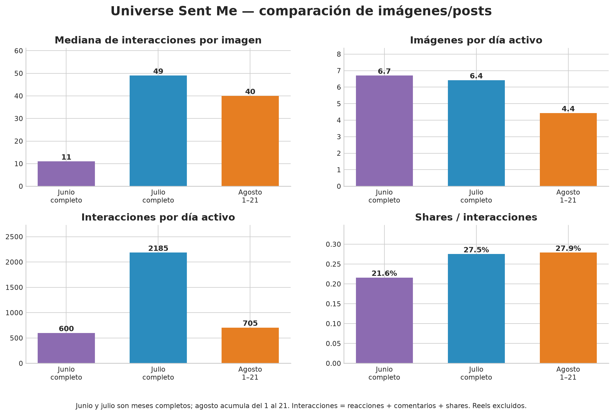
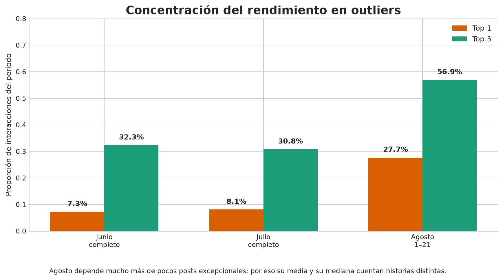

# Comparativa de crecimiento y brechas de integración — junio, julio y agosto 2026

## Dictamen ejecutivo

La comparación confirma una secuencia clara en **Facebook orgánico para imágenes/posts**: junio tuvo mucha frecuencia y bajo rendimiento típico; julio mantuvo una frecuencia parecida, pero elevó fuertemente la difusión; agosto, medido del 1 al 21, opera con menos publicaciones y se encuentra por debajo de julio en rendimiento típico, aunque todavía está por encima de junio en mediana e interacciones por día. La conclusión no es que agosto esté “en picada” frente a todo el histórico: está **por debajo de julio y por encima de junio en varios indicadores de pieza y ritmo diario**. [1] [2]

> **Veredicto CGO:** el problema actual de agosto es principalmente una combinación de **menor frecuencia, menor consistencia y mayor dependencia de unos pocos outliers**. No hay evidencia suficiente para atribuir la diferencia a un personaje, una sola franja horaria, el reuse o el caption de forma aislada.

La comparación se corrigió para evitar una mezcla oculta de formatos. El dataset histórico de junio, julio y agosto 1–14 contiene filas que coinciden con IDs del inventario de Facebook Reels: 29 en junio, 8 en julio y 8 en agosto 1–14. Por ello, las tablas principales de este informe son **image-only**; los Reels se reportan en una capa separada y no se suman a las conclusiones de las imágenes. [1]

## 1. Alcance y método

La base histórica homogénea contiene 230 filas de junio, 207 de julio y 64 de agosto 1–14. Para agosto se añadieron los cortes observados del 15–16, el corte actual de las cinco publicaciones P0 del 17, el corte de cohorte del 17–20 y el reporte diario del 21. Los cortes superpuestos se unieron por `Meta_Post_ID`; la unión tuvo 47 filas brutas, 40 filas únicas posteriores a la deduplicación y, junto con la base 1–14, dejó 104 publicaciones únicas de agosto: 93 imágenes/posts y 11 Reels. [1]

Todas las cifras de interacción utilizan la misma definición descriptiva: `interacciones = reacciones + comentarios + shares`. Las cifras históricas son acumulados lifetime de sus extracciones; los cortes de agosto son acumulados observables al momento de captura. No son incrementos exactos y no deben presentarse como ventanas contractuales de 24 o 72 horas. [1] [4] [5]

La comparación de agosto contra meses completos tiene **sesgo de madurez**: una publicación de agosto es más reciente que una publicación de junio o julio y ha tenido menos tiempo para acumular interacciones. Por eso se muestran dos lecturas: una comparación limpia de los primeros 14 días y una lectura MTD de agosto contra los meses completos. La primera es la comparación temporal preferida; la segunda describe el estado operativo acumulado, no un ranking histórico definitivo.

## 2. Comparación limpia: primeros 14 días, imágenes/posts

| Periodo | Imágenes/posts | Imágenes por día | Interacciones totales | Interacciones por día | Mediana de interacciones | Mediana de shares | Shares / interacciones |
|---|---:|---:|---:|---:|---:|---:|---:|
| Junio 1–14 | 111 | 7.9 | 6,630 | 473.6 | 6 | 0 | 20.9% |
| Julio 1–14 | 93 | 6.6 | 22,320 | 1,594.3 | 41 | 7 | 23.9% |
| Agosto 1–14 | 56 | 4.0 | 12,170 | 869.3 | 35 | 6.5 | 28.8% |

Agosto 1–14 publicó **49.5% menos imágenes por día que junio** y **39.8% menos que julio**. Aun con esa menor superficie, superó a junio en interacciones por día en **83.6%** y en mediana por publicación en **483.3%**. Frente a julio, sin embargo, quedó **45.5% por debajo en interacciones por día** y **14.6% por debajo en mediana**. [1] [2]

La proporción de shares fue la más alta de los tres periodos en agosto 1–14: **28.8%**, frente a 23.9% en julio y 20.9% en junio. Esto sugiere que la capacidad de compartir no desapareció; el problema es que agosto produjo menos piezas y no sostuvo la densidad de resultados de julio. La proporción no prueba causalidad ni compensa la falta de alcance y de impresiones.

*Figura 1. Mediana, frecuencia, interacciones por día y participación de shares. Junio y julio son meses completos en la vista MTD; agosto acumula del 1 al 21. Reels excluidos.*

## 3. Estado acumulado de agosto hasta el 21

| Periodo | Imágenes/posts | Días incluidos | Imágenes por día | Interacciones | Interacciones por día | Media por pieza | Mediana por pieza | P90 |
|---|---:|---:|---:|---:|---:|---:|---:|---:|
| Junio completo | 201 | 30 | 6.7 | 17,985 | 599.5 | 89.5 | 11 | 351 |
| Julio completo | 199 | 31 | 6.4 | 67,727 | 2,184.7 | 340.3 | 49 | 692 |
| Agosto 1–21 | 93 | 21 | 4.4 | 14,812 | 705.3 | 159.3 | 40 | 273 |

En ritmo diario, agosto MTD está **17.7% por encima de junio**, pero **67.7% por debajo de julio**. Su mediana de 40 interacciones está **263.6% por encima de junio** y **18.4% por debajo de julio**. La frecuencia sigue siendo la diferencia operacional más visible: agosto publica aproximadamente **33.9% menos imágenes por día que junio** y **31.0% menos que julio**. [1] [2]

La diferencia entre media y mediana es importante. Agosto tiene una media de 159.3, pero una mediana de 40; esto significa que unos pocos posts elevan el promedio mientras muchas piezas se mantienen en un nivel menor. Julio, aunque también contiene outliers, tiene una mediana de 49 y una cola alta más profunda. El objetivo de la siguiente ola no debe ser producir un único outlier, sino elevar la mediana sin perder la posibilidad de piezas de cola alta.

## 4. Concentración y consistencia

| Periodo | Participación del top 1 | Participación del top 5 | Piezas con ≥50 interacciones | Piezas con ≥100 | Piezas con ≥300 | Piezas con ≥500 |
|---|---:|---:|---:|---:|---:|---:|
| Junio completo, imágenes | 7.3% | 32.3% | 36/201 | 27/201 | 22/201 | 12/201 |
| Julio completo, imágenes | 8.1% | 30.8% | 99/199 | 73/199 | 46/199 | 28/199 |
| Agosto 1–21, imágenes | 27.7% | 56.9% | 40/93 | 20/93 | 8/93 | 5/93 |

*Figura 2. Agosto depende mucho más de pocos posts excepcionales que junio o julio.*

Agosto está concentrando demasiado resultado en pocos casos. Su mejor post, `😒` del 4 de agosto, registró 4,103 interacciones y por sí solo representa 27.7% del MTD image-only. Los cinco primeros suman 56.9%. En contraste, el mejor post image-only de junio representa 7.3% y el de julio 8.1%. [1]

El top de agosto no está vacío: además de `😒` con 4,103, aparecen una pieza de humor observacional del 3 de agosto con 1,702, el mensaje de supervivencia del 1 de agosto con 1,319, una pieza de Kael del 11 de agosto con 669 y el post P0 `2608028` con 636. La lectura correcta es **capacidad de generar aciertos grandes, pero falta de distribución consistente alrededor de ellos**. [1]

El resultado P0 refuerza la misma cautela: `2608028` acumuló 636 interacciones observadas y concentró 81.0% de las cinco publicaciones P0. El aprendizaje es útil para diseñar una réplica estructural —situación amplia, composición clara, secuencia visual y caption mínimo—, pero no valida que un horario, un personaje o tres emojis sean la causa directa. [5]

## 5. Qué funcionó en cada periodo

### Junio: frecuencia alta, señales fundacionales y baja mediana

Junio publicó 201 imágenes/posts no identificados como Reels en la base comparable. Sus mejores casos muestran que ya existían los motores que después se hicieron más visibles: reacción mínima, situación relatable y potencial de difusión. Entre los casos de mayor valor aparecen `Me da miedo ser el malo de la historia...` con 1,308 interacciones y 392 shares, `No sean así.. 😆` con 1,181 y 188 shares, `El gato: 😧` con 1,128 y 127 shares, `yo Aura Fuerte 😏` con 1,127 y 211 shares y `😏` con 1,069 y 200 shares. [1] [6]

La señal de junio no es “publicar más sin control”. Es que el volumen permitió más oportunidades de descubrimiento y dejó una biblioteca fundacional amplia. La mediana baja indica que la frecuencia, por sí sola, no garantizaba que cada pieza funcionara.

### Julio: salto real de difusión y mejor rendimiento típico

Julio publicó 199 imágenes/posts no identificados como Reels, prácticamente el mismo volumen mensual que junio, pero obtuvo 67,727 interacciones frente a 17,985 en junio. La mediana subió de 11 a 49 y la mediana de shares de 1 a 8. Esto descarta que el salto sea únicamente consecuencia de publicar más. [1] [2]

Los casos principales fueron `🫣🫣` con 5,482 interacciones y 2,312 shares; `😐` con 3,993 y 1,449 shares; `🥴🤯 escucho borroso....` con 3,913 y 1,521 shares; `😮‍💨` con 3,740 y 904 shares; y `No es desinterés...` de Fantasma con 3,726 y 1,341 shares. Julio combinó dos motores: **difusión de baja fricción** y **situaciones lo bastante claras para producir identificación, comentarios o etiquetas**. [1] [6]

La revisión visual ya corrigió la atribución por filename: de los seis top posts directos, solo dos muestran claramente a Universe, uno muestra a Fantasma y tres no permiten asignar un personaje canónico concreto. Por tanto, julio no demuestra que Universe como personaje aislado sea la causa; respalda mejor la situación reconocible, el remate y la compartibilidad. [7]

### Agosto: buenos aciertos, menor superficie y menor regularidad

Agosto 1–21 contiene 93 imágenes/posts y 11 Reels en la unión actual. En imágenes, los mejores casos muestran que todavía existe capacidad de distribución: `😒` alcanzó 4,103 interacciones y 1,215 shares; una pieza observacional del 3 de agosto llegó a 1,702 y 586 shares; y el P0 `2608028` llegó a 636 y 172 shares. Sin embargo, 56.9% de las interacciones image-only dependen de los cinco primeros posts, frente a 30.8% en julio. [1]

El corte diario del 21 de agosto ofrece una señal reciente compatible con la hipótesis vigente: `Relatable_Social` n=3 obtuvo 156 interacciones y 52 shares; `Difusión_Minimal` n=3, 148 y 33; y `Ácido_Interpersonal` n=2, 64 y 16. Son direcciones de prueba, no familias ganadoras. La muestra contiene mezcla de horarios, personajes y estados de reuse, y no debe combinarse con el histórico mensual como si fuera una celda balanceada. [8]

## 6. Reels: comparación separada y estado de instrumentación

La base histórica contiene coincidencias conocidas con el inventario de Reels: 29 filas en junio, 8 en julio y 8 en agosto 1–14. Estas coincidencias se excluyeron de las tablas de imágenes, pero se conservan en la capa all-format para trazabilidad. [1]

Para agosto 1–21, la unión actual contiene 11 Reels con 145 interacciones básicas observadas, 16 comentarios y 16 shares; la mediana es de 11 interacciones. Esta cifra **no permite concluir que los Reels sean inferiores a las imágenes**, porque no contiene denominadores de views, reach, retención, tiempo medio visto ni completaciones para todas las filas, y además las publicaciones no tienen la misma edad ni el mismo contexto de distribución. [1] [9]

La lectura correcta es operacional: el canal de Reels tiene una brecha de instrumentación, no un veredicto de contenido. El protocolo vigente establece `L1` —reacciones, comentarios y shares— como base del reporte diario; Windsor e Instagram integrado quedan como fuentes de enriquecimiento `L2/L3` cuando entreguen views, reach y retención, conservando fuente, hora de extracción, unidad y ventana. [9]

La hipótesis activa sigue siendo `HB-REEL-MOTION-POV-MEME-01`: movimiento visible más hook POV/meme. MPM-001 está generado y pendiente de revisión/publicación; MPM-002 y MPM-003 siguen pendientes de generación por cuota. Ninguno de los tres debe incorporarse como evidencia publicada antes de la aprobación humana y del ID nativo correspondiente.

## 7. Comparación de familias, personajes, captions y horarios

Las comparaciones de familias y personajes no tienen el mismo nivel de cobertura en los tres meses. Junio posee una base taxonómica individual amplia, pero parte de la identidad fue heredada de filenames y requiere prudencia; julio posee una muestra visualmente revisada mucho más pequeña; agosto solo tiene un desglose provisional completo en el corte diario más reciente. Por ello, el informe usa la taxonomía como explicación cualitativa y no como ranking causal de personajes.

| Dimensión | Junio | Julio | Agosto hasta 21 | Lectura válida |
|---|---|---|---|---|
| Familias de contenido | Taxonomía amplia, revisión visual selectiva | 22 casos individuales; 16 nuevos con revisión visual | Corte diario reciente: 3 Relatable, 3 Difusión mínima, 2 Ácido y casos únicos | Priorizar celdas comparables, no promediar etiquetas heterogéneas |
| Personaje principal | 172 filas taxonómicas con riesgo de sobreasignación por filename; 17 casos revisados selectivamente | 22 casos reconciliados; seis top con revisión directa y 16 nuevos conservadores | Corte diario: Universe n=6; otros personajes n=1 y un caso no identificado | El personaje es variable de prueba, no explicación automática |
| Caption | Clasificación histórica parcial | `historical_unavailable` en la ampliación cuando no hay fuente verificable | Treatments operativos separados en las nuevas pruebas | No atribuir el rendimiento al caption sin control balanceado |
| Horario | Agregado completo, sensible a outliers | Agregado completo, pero la ampliación individual está sesgada a posts de alto interés | Rotación y corte diario en operación | Probar 18:00–22:00 como corredor, sin declararlo ley |
| Shares | Mediana 1 en imágenes | Mediana 8 en imágenes | Mediana MTD 8; 28.0% del total de interacciones image-only | Mantener shares como señal de difusión, separada de comentarios |
| Comentarios | 72 recuperados en cinco posts prioritarios | 284 extraídos en 16 matches nuevos | Captura incremental de cortes diarios | Abrir hilos solo con una pregunta de community management |

## 8. Qué falta por integrar de junio

Junio está **suficientemente integrado para operar el Growth OS**. La base de rendimiento está completa a nivel comparable; el vínculo histórico individual es amplio y los assets prioritarios ya fueron reconciliados. El ledger individual contiene 178 filas de junio, 173 Meta IDs únicos y 172 Meta IDs no-Reel con `Asset_Ref`, equivalentes a una cobertura aproximada de 85.6% sobre las 201 imágenes/posts no-Reel de la base. [3] [6]

| Capa de junio | Estado actual | Qué falta realmente | Decisión |
|---|---|---|---|
| Métricas comparables | 201 imágenes/posts y 29 Reels identificados en la base | No falta cerrar el agregado | Mantener como referencia histórica |
| Asset → Meta → publicación | 172 relaciones iniciales confirmadas; 172 no-Reel con Asset_Ref en el ledger ampliado | 57 casos permanecen en cola sin match; 17 referencias originales no eran utilizables | No reconciliar masivamente |
| Taxonomía | 172 filas base más revisión selectiva de 17 casos | Ampliar solo si una fila completa una celda o responde una hipótesis | Prioridad selectiva |
| CNT | Seis CNT prioritarios `CNT-080`–`CNT-085` integrados para reuse | No convertir todos los assets históricos confirmados en CNT | Congelado hasta abrir una cola reuse |
| Comentarios | 72 comentarios en cinco posts prioritarios | No existe lectura cualitativa de todo junio | Abrir solo por pregunta concreta |
| Ventanas 24/72h | No reconstruibles | No hay acción válida para recuperarlas retroactivamente | No ejecutar |

Los 57 casos sin match deben conservarse como **reserva de investigación**, no como deuda que bloquee agosto. La cola sí puede reabrirse si una futura celda necesita un tercer caso comparable, si se busca un reuse específico o si una hipótesis de personaje/formato exige evidencia visual adicional. La prioridad no es producir más CNT, sino preservar la trazabilidad y evitar canonizar el sesgo histórico hacia Universe.

## 9. Qué falta por integrar de julio

Julio tiene el agregado mensual completo, pero su integración individual sigue siendo parcial. Hay 199 imágenes/posts no-Reel en la base y 22 publicaciones reconciliadas individualmente con `Asset_Ref`, una cobertura aproximada de 11.1%. Las otras 177 imágenes/posts no están todas en la misma situación operativa —la referencia histórica las describe como publicaciones aún solo presentes en la capa comparable mensual y conserva un caso borderline fuera del lote ampliado—, pero no deben tratarse como reconciliadas asset→Meta→CNT. [3] [7]

| Capa de julio | Estado actual | Qué falta realmente | Decisión |
|---|---|---|---|
| Métricas comparables | 207 filas base; 199 imágenes/posts y 8 Reels identificados | No falta cerrar el agregado | Mantener como referencia mensual |
| Top posts | Seis casos con revisión visual directa | No falta cerrar esos seis | No duplicar trabajo |
| Ampliación individual | 16 matches visuales nuevos; 22 casos individuales totales | Solo faltan casos que respondan una pregunta concreta | Continuar selectivamente |
| Taxonomía visual | 22 casos individuales; 16 nuevos con revisión conservadora | Falta cobertura del resto del mes | No clasificar masivamente |
| CNT | No se crearon CNT masivos para la ampliación | No falta crear CNT para usar la evidencia analítica | Mantener separación histórica/operativa |
| Comentarios | 284 comentarios de 16 matches nuevos | No justifica leer los 284 manualmente | Priorizar cuatro hilos con preguntas o identificación |
| Celdas comparables | Observacional alcanza señal preliminar; varias celdas siguen bajo `n=3` | Microhistoria estricta, transformación y diálogo ácido necesitan casos nuevos | Usar briefs FUT aprobados |
| Ventanas 24/72h | No reconstruibles | No hay acción válida retroactiva | No ejecutar |

La siguiente ampliación de julio solo tiene sentido si cierra una brecha concreta de las celdas `MICRO-STRICT-3P`, `TRANS-UNIVERSE`, `DIALOGUE-ACID` o de una hipótesis de shares, comentarios y etiquetabilidad. No conviene ampliar por volumen, ni construir un ranking causal de personajes con los 22 casos actuales.

## 10. Qué está integrado y qué falta de agosto

Agosto ya tiene una capa de operación diaria funcional, pero no una vista MTD taxonómica tan consolidada como la histórica. La unión hasta el 21 contiene 93 imágenes/posts y 11 Reels, y el corte diario del 21 registra 10 imágenes y 2 Reels de forma separada. El aprendizaje diario es la fuente principal; los snapshots de 24/72 horas no deben forzarse. [8] [9]

| Capa de agosto | Estado al 21 de agosto | Pendiente operativo |
|---|---|---|
| Métricas de imágenes | Base 1–14 más cortes observados 15–21 unidos por Meta ID | Continuar el reporte diario y no recontar filas superpuestas |
| Métricas de Reels | 11 Reels con interacciones básicas | Enriquecer L2/L3 con Windsor/Instagram cuando el campo exista; no escribir ceros ausentes |
| Taxonomía MTD | No existe una matriz exhaustiva equivalente a junio/julio | Clasificar por familia/personaje solo en cortes y celdas comparables |
| Celda Motion + POV/Meme | Hipótesis activa; MPM-001 generado; MPM-002/003 pendientes | Revisión humana, cuota de generación y después publicación autorizada |
| ExperimentLog | Tiene observaciones diarias y no mezcla afiliados | Añadir aprendizajes posteriores al corte diario, sin convertir acumulados en deltas |
| Afiliados | Capa separada del engagement editorial | Mantener links, productos, clicks y ventas fuera de estas tablas |

## 11. Decisión de Growth OS

El aprendizaje histórico que debe pasar a la siguiente ola no es “copiar julio”, sino operar una matriz que eleve la consistencia. La propuesta es mantener una frecuencia controlada de aproximadamente cinco a siete imágenes/posts diarios cuando el calendario lo permita, con una mezcla explícita de `Nueva`, `Reuse_Top` y `Reuse_NoTop`, y distribuir horarios sin cambiar simultáneamente formato, familia y slot. La métrica transversal será la mediana de interacciones; las métricas primarias por familia serán shares para difusión y comentarios raíz/replies para conversación. Esta propuesta retoma el diseño de prueba existente y no modifica por sí misma el calendario vigente. [4]

Para Reels, el aprendizaje histórico no debe mezclarse con las imágenes. Se mantiene la celda `HB-REEL-MOTION-POV-MEME-01`, con movimiento físico legible, hook POV/meme, comprensión sin audio y captions mínimos como tratamiento. El criterio de avance sigue siendo al menos tres casos comparables para una señal preliminar y cinco para una decisión operativa. Views, reach y retención deben venir de una fuente autorizada y conservar su unidad; la ausencia de un campo se registra como `null` o `Unavailable`, nunca como cero. [9]

La decisión final es **cerrar la integración básica de junio y julio para uso operativo, mantener ampliaciones históricas selectivas y concentrar el trabajo inmediato en la consistencia de agosto y la instrumentación de Reels**. La deuda histórica restante no debe volver a desplazar el corte diario, la producción controlada ni la medición de las nuevas celdas.

## 12. Documentos que requieren coherencia

Este informe no reemplaza el histórico original ni altera calendarios, CNT, canon, afiliados o publicaciones. Para evitar ambigüedad, se actualizan dos puntos de navegación: el comparativo del 14 de agosto conserva su lectura original all-format y añade una nota de alcance; la fuente maestra e índice enlazan este informe y sus artefactos image-only. El Changelog registra la nueva versión documental.

## Referencias

[1]: https://github.com/iomarketing09-sys/universe-sent-me-growth-os/blob/main/Operations/Research/2026-08-22_Comparativa_Junio_Julio_Agosto_Datos.json "Datos reproducibles de la comparación junio-julio-agosto"
[2]: https://github.com/iomarketing09-sys/universe-sent-me-growth-os/blob/main/Operations/Research/2026-08-22_Comparativa_Junio_Julio_Agosto_Resumen.csv "Resumen tabular normalizado"
[3]: https://github.com/iomarketing09-sys/universe-sent-me-growth-os/blob/main/Operations/Research/2026-08-22_Comparativa_Junio_Julio_Agosto_Integracion.csv "Matriz de brechas de integración"
[4]: https://github.com/iomarketing09-sys/universe-sent-me-growth-os/blob/main/Operations/Research/2026-08-14_Comparativo_Desempeno_Junio_Julio_Agosto.md "Comparativo temprano de desempeño y calendario"
[5]: https://github.com/iomarketing09-sys/universe-sent-me-growth-os/blob/main/Operations/Research/2026-08-19_P0_Corte_17_Agosto.md "Corte P0 y análisis del outlier 2608028"
[6]: https://github.com/iomarketing09-sys/universe-sent-me-growth-os/blob/main/Operations/Research/2026-08-17_Reporte_Final_Recopilacion_Junio.md "Reporte final de recopilación histórica de junio"
[7]: https://github.com/iomarketing09-sys/universe-sent-me-growth-os/blob/main/Operations/Research/2026-08-21_Julio_Expansion_Lote01_Analysis.md "Ampliación individual de julio, lote 01"
[8]: https://github.com/iomarketing09-sys/universe-sent-me-growth-os/blob/main/Operations/Research/2026-08-21_Analisis_Corte_Diario_Familias_Personajes.md "Análisis diario por familias y personajes"
[9]: https://github.com/iomarketing09-sys/universe-sent-me-growth-os/blob/main/Operations/Research/2026-08-22_Reels_Metric_Instrumentation_Protocol.md "Protocolo de instrumentación L0–L4 de Reels"
