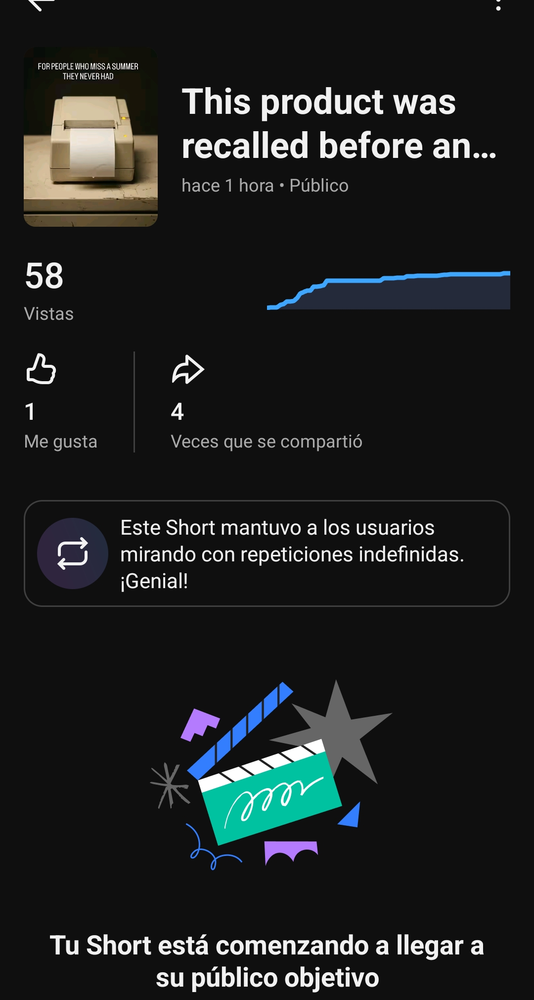

# Bam in a Can — CAN-002: chequeo inicial de visibilidad

## Propósito del corte

Este documento registra el primer chequeo de CAN-002 solicitado tras cerrar su cascada. El corte se declaró a las **20:12:20 CDT del 23 de agosto**. No corresponde a T+3 h en ninguna plataforma: TikTok tenía 1 h 12 min 37 s; Instagram Reels 51 min 43 s; y YouTube Shorts 15 min 20 s. Por ello, describe visibilidad e indexación iniciales, no rendimiento temprano comparable.

## Datos observados

| Plataforma | Edad al corte declarado | Fuente / hora de consulta | Métricas disponibles | Interpretación correcta |
|---|---:|---|---|---|
| TikTok | 1 h 12 min 37 s | Windsor.ai, `data_fetched_at` 01:12:41 UTC | 26 views; 0 likes; 0 comentarios; 0 shares; 0 favoritos; duración 9.73 s; avg. watch 3.03 s; total watch 72 s; full-watch rate 8.33 %. | El avg. watch equivale a **31.14 %** de la duración. Es una observación inicial de volumen mínimo, no una lectura de distribución. El caption recuperado por Windsor incluye `Original fiction. AI-made.`. |
| Instagram Reels | 51 min 43 s | Windsor.ai, consulta 01:13:21 UTC; permalink público 01:14:22 UTC | Windsor no devolvió fila. El permalink público confirma caption/disclosure y muestra **0 comentarios**. | La ausencia de fila no equivale a cero views, reach, likes, shares o saves. |
| YouTube Shorts | 15 min 20 s | Windsor.ai, consulta 01:13:53 UTC; Short público 01:14:36 UTC | Windsor no devolvió fila. La vista pública muestra **1 like** y **0 comentarios**; no expone views. | Es evidencia pública de interacción inicial, no un dataset completo. La fila autenticada sigue pendiente de indexación. |

## Lectura operativa

No se valida una hipótesis creativa, de audio o de plataforma en este corte. La pieza tiene menos de 75 minutos en TikTok y menos de una hora en Instagram, mientras que YouTube todavía no indexa sus métricas en Windsor.ai. Las dos versiones con audio nativo compartido y la versión de SFX no tienen edades equivalentes ni datos suficientes para comparar consumo o atribuir un efecto a `she share post (for blog)`.

El siguiente corte útil empieza después de que YouTube cumpla su propia ventana T+3 h, a las **22:57 CDT**. Se deben repetir las consultas autenticadas de las tres redes y conservar por separado las métricas de plataforma, la fuente y la edad real de cada post.

## Reconsulta tras confirmar conectores

Fernando confirmó que actualizó la conexión de Instagram en Windsor.ai. La reconsulta verificó que la cuenta `bam_inacan` permanece listada como cuenta activa de Instagram y que el canal `baminacan@gmail.com` permanece activo en YouTube. Sin embargo, la consulta de Instagram a las **20:38:53 CDT** y la de YouTube a las **20:40:32 CDT** continuaron devolviendo conjuntos vacíos para CAN-002. La conexión está disponible; las filas de contenido siguen pendientes de sincronización/indexación. No se registran métricas de cero por ese motivo.

### Validación con campos mínimos

Para respetar el límite de la cuenta gratuita, se ejecutaron consultas reducidas de cuatro campos por plataforma. Instagram usó `media_shortcode`, `media_views`, `media_reach` y `data_fetched_at` a las **20:46:42 CDT**; YouTube usó `video_title`, `views`, `likes` y `data_fetched_at` a las **20:46:59 CDT**. Ambas devolvieron conjuntos vacíos cuando se aplicó el filtro de fecha de la publicación. Esto no prueba que falten los contenidos: describe el comportamiento de esa forma de consulta.

### Diagnóstico confirmado — Instagram

La cuenta `bam_inacan` y sus capacidades de media/insights están operativas. Una consulta de inventario **sin filtro de fecha**, con solo `media_shortcode`, `media_caption` y `data_fetched_at`, devolvió CAN-001 y CAN-002 a las **20:51:19 CDT**. Una segunda consulta de CAN-002 por shortcode, también sin rango de fechas, devolvió **200 views** y **reach 34** a las **20:51:35 CDT**; un tercer bloque reducido devolvió **0 likes** y **0 comentarios** a las **20:51:47 CDT**.

La causa de los conjuntos vacíos de Instagram no fue el número de fields, ni una falta de permisos, ni la ausencia del Reel: fue el uso del rango de fechas junto con la consulta de media. A partir de ahora, para Reels individuales de Bam se debe consultar por `media_shortcode` **sin** `date_from`/`date_to`, mediante bloques de hasta cuatro fields. YouTube continúa sin fila incluso con campos mínimos y requiere una ruta de diagnóstico separada.

### Actualización de métricas de Instagram

El refresh conjunto de CAN-001 y CAN-002 mantuvo el filtro por shortcode sin rango de fechas. Para CAN-002, el bloque de views/reach conservó `data_fetched_at` **20:51:35 CDT**: **200 views** y **reach 34**. El bloque de interacciones devolvió 0 likes, 0 comentarios y 0 shares. El bloque de consumo devolvió `data_fetched_at` **20:57:54 CDT**, con avg. watch time raw `8536` y total watch time raw `290246`, documentados como **8.536 s** y **290.246 s** tras convertir de milisegundos.

El avg. watch equivale aproximadamente al **85 %** de los 10 segundos de CAN-002, pero no autoriza un veredicto creativo todavía: la pieza tiene menor alcance, el snapshot sigue temprano y no hay control cuantitativo de YouTube. La lectura correcta es que la retención inicial merece seguimiento, no que el audio ni el formato ya estén validados.

### Evidencia directa de YouTube Studio

Fernando aportó una captura de YouTube Studio para `-P8er9X9ggw`. El nombre del archivo indica **21:10:22 CDT**; usado como timestamp de registro, el Short tenía **1 h 13 min 22 s** desde su T0. Studio muestra **58 vistas**, **1 like** y **4 veces compartido**. La interfaz también presenta el mensaje cualitativo de que el Short mantuvo a usuarios viendo con repeticiones indefinidas; no expone en esta captura una cifra de retención, duración media ni porcentaje, por lo que ese mensaje no se convierte en una métrica numérica.

El conteo es una señal inicial de distribución y compartidos a seguir, no una validación de audio, formato ni hipótesis creativa. Tiene una edad muy corta, una muestra pequeña y una definición de métricas no equiparable con TikTok o Instagram. Windsor.ai todavía no devolvía una fila de este Short en la última consulta mínima, de modo que Studio queda registrado como la fuente manual provisional.

## Límites y actualizaciones relacionadas

El ledger registra este control como `pre-T3` dentro del campo de snapshot para evitar que la información se pierda, pero no debe leerse como el snapshot T+3 h programado. Este documento actualiza la interpretación de lanzamiento de CAN-002; los documentos relacionados que requieren el siguiente ajuste son el ledger de distribución y el paquete de Semana 01, ambos modificados en este mismo cambio.
