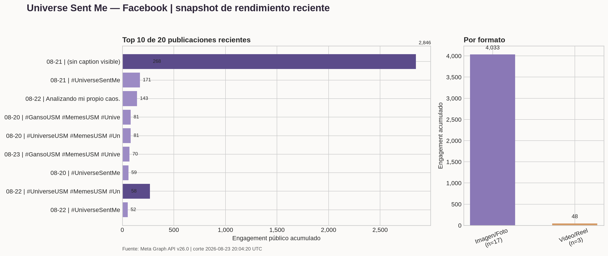

# Reporte de rendimiento y engagement — Facebook

**Propósito:** Presentar el rendimiento reciente de la Página de Facebook Universe Sent Me usando datos nativos de Meta y auditar si la información está integrada correctamente en el Growth OS.

**Estado:** Active
**Fecha de creación:** 2026-08-23
**Última actualización:** 2026-08-23
**Versión:** 1.2
**Autor:** Manus AI  
**Organización:** `Operations/Research/`  
**Documentos relacionados:** `GrowthOS/Integracion_Growth_OS.md`, `GrowthOS/14_00_Fuente_Maestra_y_Ledgers.md`, `GrowthOS/06_00_Reglas_Aprendizaje_Tendencias.md`, `Operations/Research/2026-08-22_Analisis_Semanal_20260816_20260822.md`, `Operations/Research/2026-08-15_Publication_Log.csv`, `Operations/Research/2026-08-15_ExperimentLog.csv`, `Operations/Research/2026-08-23_Facebook_Performance_Meta_API.json`, `Operations/Research/2026-08-23_Facebook_Performance_Summary.json`, `Operations/Research/2026-08-23_Facebook_Growth_Integration_Audit.json`, `Operations/Research/2026-08-23_Facebook_Post_Reconciliation.json`, `Operations/Research/2026-08-23_Facebook_Performance_Recent_Chart.png`, `Operations/Research/2026-08-23_Facebook_24_72_Window_Closure.json`, `Operations/Research/2026-08-23_Facebook_24_72_and_Video_Insights_Summary.json`, `Operations/Research/2026-08-23_Facebook_Reels_Video_Insights.csv`, `Operations/Research/2026-08-23_Facebook_Windsor_Insights_Raw.json`, `../../tools/validate_facebook_windows_video_insights.py`

---

## 1. Resumen ejecutivo

El snapshot vivo de Meta Graph API v26.0 incluye las **20 publicaciones más recientes** de Universe Sent Me, publicadas entre el 20 de agosto a las 15:00 UTC y el 23 de agosto a las 18:30 UTC. Al momento de la extracción, esas publicaciones acumulaban **4,081 interacciones públicas observables**, calculadas como reacciones + comentarios + shares. La mediana fue **45.5** por publicación y la media **204.05**; la diferencia muestra una distribución muy concentrada y dominada por un outlier. [1]

El post filosófico con el mensaje visible `☁️✨🤔`, asociado al ID `1036844829507460_122151375549072582`, acumuló **2,846 interacciones** y representa **69.7%** del total del snapshot. Los dos primeros posts representan **76.3%**. Por tanto, el rendimiento reciente no debe interpretarse con la media simple: la señal central es mucho más baja y la difusión está concentrada en pocas piezas. [1]

La integración con el Growth OS está **bien definida a nivel de arquitectura y parcialmente ejecutada a nivel operativo**. El proyecto ya tiene una definición métrica, ledgers de publicación y experimentos, HypothesisBank y reportes semanales. En esta ronda se procesaron las ventanas vencidas, pero el cierre estricto quedó en `Unavailable_No_Baseline`: hubo **27 publicaciones elegibles**, **22 ventanas de 24h** y **20 de 72h**, con 27 respuestas HTTP 200 y **cero escrituras exactas** porque Meta devolvió acumulados lifetime sin baseline histórico. En paralelo, Windsor.ai permitió extraer reach/discovery y señales parciales de watch para **cuatro Reels**, todos en nivel `L2_Discovery` + watch parcial, sin convertirlos en retención L3. La reconciliación previa dejó **20 de 20 publicaciones recientes** con coincidencia por ID. El crosswalk está corregido, pero el pipeline aún no es de extremo a extremo para ventanas exactas ni retención completa. [1] [3] [4] [5] [6] [7] [8] [9]

## 2. Alcance y definición métrica

La extracción se realizó en modo lectura el 23 de agosto de 2026 a las 20:04:20 UTC sobre las 20 publicaciones más recientes de la Página. El periodo visible de publicación va del 20 al 23 de agosto; no es una ventana fija de 24 o 72 horas y los valores son acumulados al momento de consulta. [1]

| Campo | Valor |
|---|---:|
| Publicaciones incluidas | 20 |
| Periodo de publicación visible | 2026-08-20 15:00 UTC – 2026-08-23 18:30 UTC |
| Engagement público total | 4,081 |
| Media por publicación | 204.05 |
| Mediana por publicación | 45.5 |
| Reacciones | 2,927 |
| Comentarios | 126 |
| Shares | 1,028 |
| Definición usada | Reacciones + comentarios + shares |
| Tasa de engagement | No calculable: Meta no entregó impresiones o alcance utilizables |

Las shares representan aproximadamente **25.2%** del engagement observable, los comentarios **3.1%** y las reacciones **71.7%**. La proporción de shares es una señal descriptiva de difusión, no una tasa de compartibilidad, porque el denominador correcto —alcance o impresiones— no está disponible en este snapshot. [1]

## 3. Rendimiento por formato

El snapshot clasificó 17 piezas como Imagen/Foto y 3 como Video/Reel según los adjuntos expuestos por Meta. Las imágenes reunieron **4,033 interacciones**, con mediana de **58**; los tres videos/Reels reunieron **48**, con mediana de **12**. [1]

| Formato | N | Engagement total | Media | Mediana | Reacciones | Comentarios | Shares |
|---|---:|---:|---:|---:|---:|---:|---:|
| Imagen/Foto | 17 | 4,033 | 237.24 | 58 | 2,889 | 122 | 1,022 |
| Video/Reel | 3 | 48 | 16.00 | 12 | 38 | 4 | 6 |

Esta diferencia **no es un veredicto causal contra Reels**. Las unidades tienen distinta madurez, distribución y tamaño de muestra, y Meta no entregó alcance, impresiones, reproducciones o retención utilizables para los posts individuales. El resultado correcto es que Facebook tiene una señal de imágenes mucho más sólida en este corte y una brecha de instrumentación para video, no que el formato de imagen sea universalmente superior. [1] [2]

## 4. Evolución por día de publicación

| Fecha UTC | Posts | Engagement | Media | Mediana | Lectura |
|---|---:|---:|---:|---:|---|
| 20 ago | 6 | 307 | 51.17 | 49.0 | Nivel moderado y relativamente estable. |
| 21 ago | 5 | 3,102 | 620.40 | 39.0 | Total dominado por el outlier de 2,846. |
| 22 ago | 5 | 546 | 109.20 | 58.0 | Mejor mediana que el 21; requiere más casos. |
| 23 ago | 4 | 126 | 31.50 | 22.0 | Menor acumulado y piezas más recientes; exposición inmadura. |

El 21 de agosto no debe declararse como “el mejor día” por su total. Sin el outlier, el día habría quedado en **256 interacciones** y la media habría sido **64** por publicación. La mediana diaria muestra que el 22 de agosto tuvo un centro superior en este snapshot, aunque la comparación no controla por formato, hora ni antigüedad. [1]

## 5. Top de publicaciones recientes

| Posición | Fecha UTC | ID de publicación | Mensaje visible | Reacciones | Comentarios | Shares | Engagement |
|---:|---|---|---|---:|---:|---:|---:|
| 1 | 21 ago | `1036844829507460_122151375549072582` | `☁️✨🤔` | 2,029 | 52 | 765 | **2,846** |
| 2 | 22 ago | `1036844829507460_122151376083072582` | `😏🙈😂` | 221 | 14 | 33 | **268** |
| 3 | 21 ago | `1036844829507460_122151375627072582` | `🙂‍↔️` | 122 | 1 | 48 | **171** |
| 4 | 22 ago | `1036844829507460_122151375843072582` | `Analizando mi propio caos. 🧐` | 103 | 3 | 37 | **143** |
| 5 | 20 ago | `1036844829507460_122151375111072582` | `💸🪿😂` | 54 | 2 | 25 | **81** |

El top 5 suma **3,509 interacciones**, equivalente a **86.0%** de las 4,081 del snapshot. El dato más útil para el Growth OS no es copiar el outlier, sino estudiar qué elementos pueden ser transferibles: claridad inmediata del planteamiento, potencial de conversación, capacidad de compartir y reconocimiento del tono del universo de marca. El análisis no prueba que un único personaje, caption o horario haya causado el resultado. [1]

## 6. Disponibilidad de insights nativos

La API aceptó algunos nombres de métricas con respuesta HTTP 200, pero devolvió listas vacías, por lo que no se deben convertir en ceros. Las métricas de impresiones, alcance único y usuarios engaged devolvieron error de métrica no válida en este contexto. [1]

| Nivel | Métrica | Resultado actual |
|---|---|---|
| Por publicación | Impresiones, impresiones únicas, usuarios engaged | No disponibles; HTTP 400 por métrica no válida. |
| Por publicación | Clicks, reacciones por tipo, views de video, tiempo promedio de video | HTTP 200, pero sin valores utilizables. |
| Página | `page_post_engagements`, reacciones totales | HTTP 200, pero sin valores en la ventana solicitada. |
| Página | Impresiones, alcance, usuarios engaged, comentarios y shares por acción | No disponibles o métrica no válida en esta consulta. |

En consecuencia, este reporte sí puede comparar **engagement público acumulado por publicación** y, para cuatro Reels, documentar un snapshot lifetime de alcance/play/watch desde Windsor. No puede calcular engagement rate temporal, cierres 24/72, CTR, eficiencia por impresión ni retención completa por pieza. La ausencia de un campo no es evidencia de rendimiento cero; es una limitación de instrumentación y de definición temporal. [7] [8] [9]

## 6.1 Cierre estricto de ventanas 24/72 e insights de video — 23 de agosto

La corrida determinista se ejecutó a las **2026-08-23 21:00:00 UTC** sobre las 33 publicaciones candidatas de `EXP-2026-08-CAL-01`. Solo 27 tenían al menos una ventana vencida. Meta respondió HTTP 200 en las 27 lecturas, pero cada respuesta fue un acumulado lifetime actual; no existía un snapshot E0 tomado al publicar ni una respuesta temporalmente acotada. Por la regla contractual del Growth OS, `Interacciones_24h` y `Interacciones_72h` permanecen vacías y no se sustituyen con totals actuales. [7]

| Control de cierre | Resultado | Interpretación |
|---|---:|---|
| Publicaciones candidatas | 33 | Cohorte evaluada |
| Ventanas 24h elegibles | 22 | Procesadas, sin valor exacto escribible |
| Ventanas 72h elegibles | 20 | Procesadas, sin valor exacto escribible |
| Publicaciones elegibles | 27 | Hay solapamiento entre 24h y 72h |
| Respuestas Meta HTTP 200 | 27 | Lectura correcta; no implica dato temporal |
| Escrituras exactas 24/72 | 0 | Estado: `Unavailable_No_Baseline` |

El artefacto de cierre conserva los totals lifetime como evidencia auxiliar y añadió marcadores `24h_snapshot_unavailable` / `72h_snapshot_unavailable` a los ledgers. El total de **2,055 interacciones lifetime** de esas respuestas no es un resultado de 24h/72h y no debe usarse como tal. La brecha pendiente se resuelve capturando un baseline al momento de publicación y snapshots posteriores con timestamp y definición estable.

Windsor.ai sí entregó un snapshot lifetime actual de `facebook_organic`, recuperado a las **2026-08-23 21:02:08 UTC**. La columna de alcance usada es `reels_post_impressions_unique`; los plays y replays provienen de `fb_reels_total_plays` y `fb_reels_replay_count`. `complete_views_organic_95pct` es un **conteo de vistas orgánicas que alcanzaron al menos 95%**, no una tasa de completitud. La proporción de average watch frente a length se conserva únicamente como indicador descriptivo; no es una tasa de retención ni un veredicto causal. [8] [9]

| Reel | Reach/discovery único | Plays totales | Replays | Watch promedio / duración | Completions orgánicas ≥95% | Interacciones observables Windsor |
|---|---:|---:|---:|---:|---:|---:|
| Doble Check (`2210896633022235`) | 184 | 203 | 27 | 11.017s / 13.403s | 8 | 2 |
| Remote Control (`2815726225473165`) | 390 | 451 | 43 | 4.420s / 30.133s | 19 | 11 |
| Farmear Aura (`2005557463434064`) | 252 | 336 | 79 | 5.621s / 8.125s | 38 | 13 |
| MPM-001 (`1581447113440863`) | 666 | 706 | 70 | 5.112s / 29.458s | 24 | 26 |

Los cuatro casos suben a **L2 de discovery** y `L2_plus_watch_signals_partial`; ninguno cumple todavía evidencia L3 completa porque no se recibió una tasa de retención de 3 segundos ni una tasa de finalización comparable. El snapshot de MPM-001 presenta una discrepancia de fuente que se conserva sin sobrescritura: Windsor reporta duración de 29.458 segundos y watch promedio de 5.112 segundos, mientras que la evidencia previa de Business Suite asociada a la misma identidad reporta un máster de 9 segundos, 411 visualizaciones, 350 espectadores, 6 segundos promedio, 34 reproducciones de 15 segundos y 113 de 3 segundos. Son cortes/definiciones distintos; no se promedian ni se declara equivalencia. [8] [9] [10]

## 7. ¿Está integrado correctamente en el Growth OS?

La respuesta es **sí a nivel de diseño; todavía no completamente a nivel de operación**. El Growth OS documenta una fuente maestra, un Publication Log por hecho de publicación, un ExperimentLog por hipótesis y observación, un HypothesisBank y una regla de actualización post-publicación. La integración conceptual está por encima de un reporte aislado: existe una ruta prevista desde Meta hacia publicación, experimento, hipótesis y próxima acción. [5]

La ejecución actual presenta cuatro brechas concretas:

| Área | Evidencia actual | Evaluación |
|---|---|---|
| Snapshot vivo | Se conserva el JSON completo del 23 de agosto con 20 posts y métricas públicas. | **Correcto**, pero todavía separado del artefacto normalizado histórico de 28 días. |
| Identidad de publicaciones | Los 20 de 20 IDs recientes coinciden ahora con Publication Log y ExperimentLog; los tres faltantes fueron reconciliados desde el inventario de Reels y el registro maestro. | **Corregido para este corte**; el crosswalk principal ya está completo. |
| Ventanas 24/72 horas | La corrida de 23 de agosto procesó 27 publicaciones elegibles —22 de 24h y 20 de 72h—, obtuvo HTTP 200 en todas y escribió cero valores exactos por ausencia de baseline. | **Cierre metodológico correcto, pero no disponible como métrica temporal**. |
| Insights de alcance y video | Windsor entregó cuatro filas con Reel ID, reach/discovery único, plays, replays, watch time y conteo de completions orgánicas ≥95%; todos están marcados lifetime actual y L2 parcial. | **Mejora de instrumentación para cuatro Reels; L3 y retención completa pendientes**. |

La base histórica también está correctamente documentada, pero no está fresca: el artefacto normalizado de Facebook de 28 días contiene 143 filas y cubre del 22 de julio al 18 de agosto, con extracción del 19 de agosto. El reporte semanal 16–22 de agosto ya integró 42 publicaciones y 3,464 interacciones básicas observables, pero declaró expresamente que eran acumulados observables y que Reels carecía de views, reach y retención por publicación. El snapshot actual extiende la lectura hasta el 23 de agosto, pero aún no reemplaza ni actualiza automáticamente ese ciclo semanal. [1] [2]

## 8. Acciones prioritarias de integración

1. **Mantener el crosswalk reconciliado**: los 20 IDs recientes ya están enlazados con Publication Log, ExperimentLog e inventario especializado de Reels. No atribuir nuevas publicaciones a contenido, personaje, horario o hipótesis sin una identidad operativa verificable.
2. **Conservar los snapshots vivos como evidencia primaria** y mantener la tabla normalizada de Windsor separada por fuente, timestamp y definición de métrica.
3. **Separar lifetime de 24/72 horas** en el Publication Log y ExperimentLog. Un acumulado actual no debe rellenar una ventana temporal que no fue capturada.
4. **Instrumentar el baseline al publicar**: registrar E0 con timestamp, alcance/plays/interacciones disponibles y un identificador de extracción; luego capturar E24 y E72 con el mismo esquema. No crear una automatización recurrente hasta aprobar explícitamente su diseño y alcance.
5. **Cerrar el circuito de hipótesis**: cada corte debe producir un veredicto explícito —señal, inconcluso o no evaluable— y una próxima acción conectada con HB-003, HB-004, HB-005 o la hipótesis de video correspondiente.
6. **Mantener el lenguaje de causalidad disciplinado**: el outlier filosófico es un caso prioritario de estudio; no valida por sí solo una regla de contenido, personaje, día u horario.

## 9. Veredicto

El Growth OS **sí está integrado como sistema documental y analítico**, pero **no está completamente integrado como pipeline automático de datos recientes**. La arquitectura, los ledgers, la definición métrica y las hipótesis están presentes; la identidad de las 20 publicaciones recientes quedó reconciliada, las ventanas fueron cerradas honestamente como `Unavailable_No_Baseline` y cuatro Reels ahora tienen evidencia Windsor L2 con watch parcial. La prioridad no es crear otro dashboard, sino capturar el baseline de publicación, preservar la separación lifetime/24/72 y cerrar el paso desde observación hasta veredicto y próxima acción.

## Referencias

[1]: `2026-08-23_Facebook_Performance_Meta_API.json` "Snapshot vivo de Meta Graph API v26.0, 20 publicaciones recientes"
[2]: `2026-08-22_Analisis_Semanal_20260816_20260822.md` "Análisis semanal de Facebook del 16 al 22 de agosto de 2026"
[3]: `2026-08-15_ExperimentLog.csv` "Ledger append-only de hipótesis y observaciones"
[4]: `2026-08-15_Publication_Log.csv` "Ledger append-only de publicaciones por plataforma"
[5]: `../../GrowthOS/Integracion_Growth_OS.md` "Documento de integración del Growth OS"
[6]: `2026-08-23_Facebook_Post_Reconciliation.json` "Reconciliación de tres Page Post IDs de Meta con los ledgers del Growth OS"
[7]: `2026-08-23_Facebook_24_72_Window_Closure.json` "Evidencia de cierre de ventanas 24/72 con 27 casos elegibles y cero escrituras exactas"
[8]: `2026-08-23_Facebook_Windsor_Insights_Raw.json` "Snapshot raw de Windsor.ai para publicaciones y Reels de Facebook"
[9]: `2026-08-23_Facebook_24_72_and_Video_Insights_Summary.json` "Resumen normalizado de ventanas e insights de video"
[10]: `2026-08-22_Meta_Business_Suite_28D_Reels_Visual_Evidence.md` "Evidencia visual previa de Meta Business Suite, incluida MPM-001"
