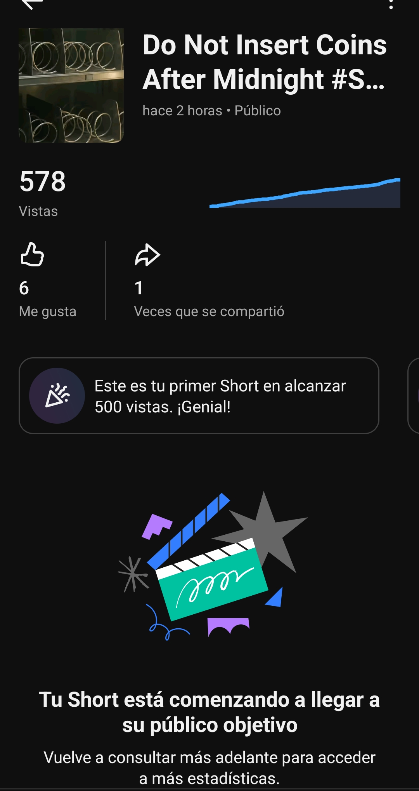
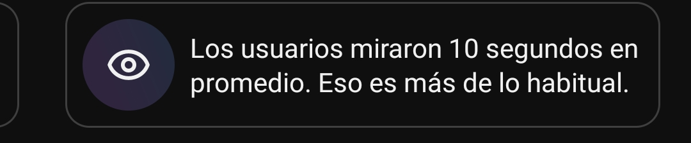
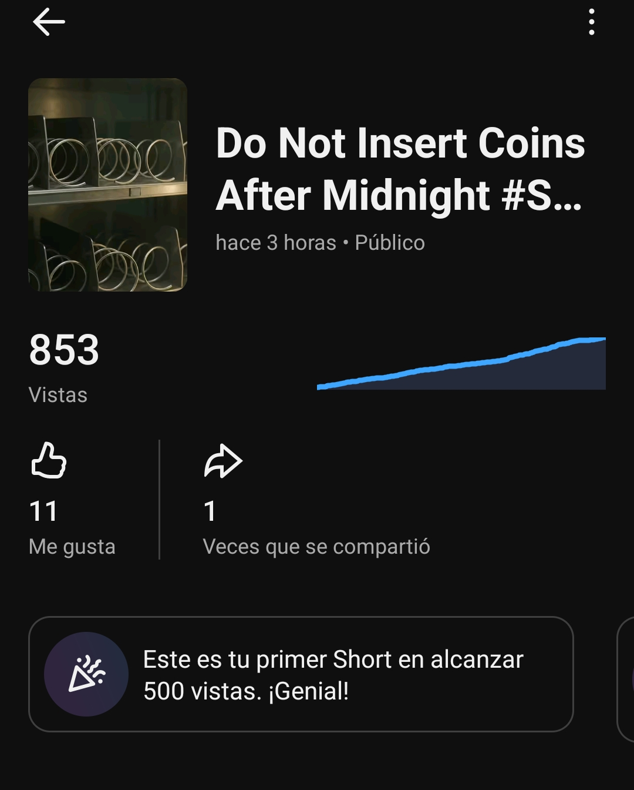
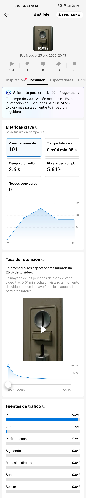
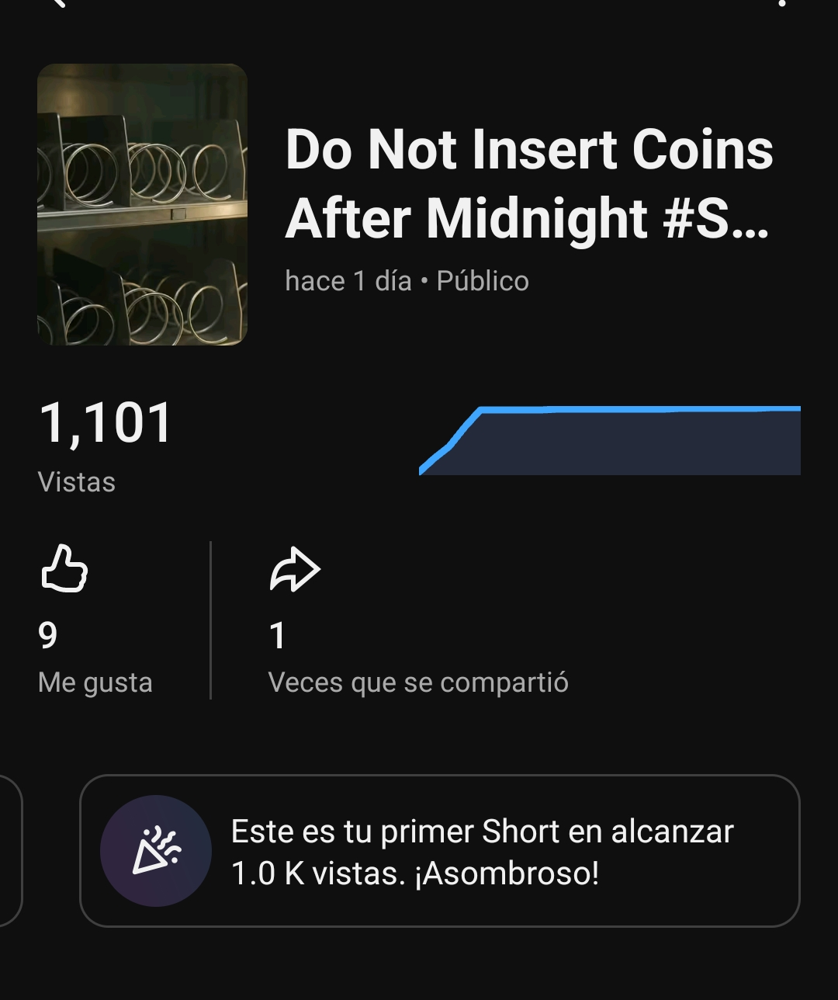

# Bam in a Can — CAN-003: corte inicial multicanal

## Propósito del corte

CAN-003, *Do Not Insert Coins After Midnight*, cerró su cascada el 25 de agosto. El corte se solicitó después de la ventana T+3 de YouTube Shorts. La evidencia no tiene la misma frescura en las tres plataformas y por ello no se usa para elaborar un ranking cross-platform ni para validar causalidad de audio, horario o formato.

| Plataforma | T0 y edad disponible | Fuente | Estado del dato |
|---|---|---|---|
| TikTok | T0 recuperado del ID: 25 Ago, 20:15:39 CDT. La fila disponible es T+7 min 13 s. | Windsor.ai `tiktok_organic` | Cache temprana; no representa T+3. |
| Instagram Reels | T0 no recuperable desde la vista pública actual. | Windsor.ai por shortcode sin rango de fechas | Sin fila; el inventario sin filtro solo devolvió CAN-002. Indexación pendiente, no cero. |
| YouTube Shorts | T0 público: 25 Ago, 20:54:05 CDT. Evidencia recibida a las 23:15:46 CDT, T+2 h 21 min 41 s. | Capturas directas de YouTube Studio | Evidencia directa preferente para este corte. |

## Métricas disponibles

| Plataforma | Métricas | Lectura limitada |
|---|---|---|
| TikTok | 2 views; 0 likes; 0 comentarios; 0 shares; 0 favoritos; avg. watch 2.99 s; full-watch rate 7.14 %. | La fila fue recuperada a T+7 min 13 s y permanecía cacheada al solicitar el corte. El valor bruto de total watch `251` no es consistente con views × avg. watch; se conserva como raw del conector, pero no se interpreta ni se convierte a segundos. |
| Instagram Reels | Sin fila autenticada de CAN-003 en la consulta individual ni en el inventario mínimo. | No se registra como 0 views, 0 reach o 0 engagement. Requiere una reconsulta posterior por shortcode `DcfDsCIMrpx`, sin fechas y en bloques reducidos. |
| YouTube Shorts | 578 views; 6 likes; 1 share; visualización media de 10 s; hito de primer Short del canal en alcanzar 500 views. | Studio indica que 10 s está por encima de lo habitual. Dado que CAN-003 dura 10 s, esta lectura es consistente con consumo de la duración completa o replay, pero no sustituye una tasa numérica de finalización. |

## Lectura de hipótesis

La señal de YouTube es claramente más fuerte que el arranque previo de CAN-002 en la misma fuente, pero no se atribuye aún a una variable única. CAN-003 combina una anomalía visible desde el inicio, cortes editoriales, SFX de control y un contenido distinto; no es una prueba aislada del hook, los SFX o el horario.

`H-BAM-TT-HOOK-01` no puede evaluarse todavía: TikTok solo aportó una fila T+7 min. `H-BAM-IG-PACKAGING-01` permanece sin evaluación: Instagram aún no indexa la pieza en Windsor. La próxima evidencia útil es el corte T+24 por plataforma, con una reconsulta de Instagram por shortcode y una nueva captura de Studio para YouTube.

## Actualización T+3 — YouTube Studio y TikTok Studio

Fernando aportó capturas directas de YouTube Studio y TikTok Studio dentro de la ventana reportada de tres horas. YouTube Studio muestra **853 views**, **11 likes** y **1 share**. Frente a la captura directa previa de 578 views y 6 likes, esto añade 275 views y 5 likes; el share permanece en 1. La evidencia anterior de YouTube también indicaba visualización media de 10 s sobre 10 s de duración, por encima de lo habitual según Studio.

TikTok Studio reporta 101 views, 0 likes, 0 comentarios, 0 shares, 0 guardados, 0 nuevos seguidores, 4 min 38 s de watch time total, avg. watch de **2.6 s**, duración de **10.05 s** y full-watch rate de **5.61 %**. El average watch equivale a **25.0 %** de la duración. El tráfico llega principalmente desde Para ti (97.2 %), con 1.9 % desde Otras y 0.9 % desde Perfil personal. La gráfica y el mensaje de la interfaz indican una caída pronunciada posterior al inicio; el reporte no permite asignar esa caída a un audio, hora o elemento creativo particular.

Instagram continuaba mostrando dos views según el reporte manual de Fernando. Como Windsor todavía no devuelve fila para `DcfDsCIMrpx`, este valor se conserva como evidencia manual de estado y no como métrica autenticada comparable.

Estas señales permiten formular hipótesis preliminares de hook y replay, documentadas en el Plan de lanzamiento de audiencia. No validan una hipótesis: CAN-003 es un solo activo, cada plataforma tiene distribución y medición distinta, y la respuesta de Instagram todavía no está disponible.

## Corte operativo posterior a T+24 — 26 de agosto

El corte se ejecutó aproximadamente a las **21:50–21:53 CDT**, después de la ventana T+24 de YouTube. La evidencia no se etiqueta como T+24 exacto en TikTok o Instagram porque sus T0 nativos no están confirmados con la misma precisión.

| Plataforma | Fuente y edad aplicable | Métricas actuales | Lectura interna |
|---|---|---|---|
| TikTok | Windsor `tiktok_organic`, `data_fetched_at` 21:50:25–21:50:49 CDT; T+25 h 35 min desde el T0 recuperado. | 146 views; 1 like; 0 comentarios; 0 shares; 0 favoritos; avg. watch 2.95 s; total watch 477 s; duración 10.055 s; full-watch rate 6.17 %. | El avg. watch equivale a 29.34 % de duración. Frente al screenshot T+3, el consumo mejora levemente de 2.6 s a 2.95 s y la finalización de 5.61 % a 6.17 %, pero sigue por debajo de los umbrales exploratorios de 3 s / 10 % y no hay señal de distribución activa. |
| Instagram Reels | Windsor por shortcode, `data_fetched_at` 21:52:33–21:52:57 CDT; el T0 exacto no está confirmado. | 26 views; reach 21; 0 likes; 0 comentarios; 0 shares; 0 saves; avg. watch 5.493 s; total watch 131.843 s. | El Reel ya está indexado y supera las dos views manuales tempranas, pero la muestra sigue siendo muy pequeña y no hay interacción activa. El avg. watch equivale aproximadamente a 54.93 % de 10 s. |
| YouTube Shorts | Captura directa de Studio recibida a las 21:51:49 CDT; aproximadamente T+24 h 57 min. | 1,101 views; 9 likes; 1 share; hito de primer Short del canal en superar 1.0 K views. | Las views suben de 853 en la captura T+3 a 1,101. El share permanece en 1. Los likes pasan de 11 a 9 en la interfaz, por lo que no se infiere una caída de afinidad: puede haber retiro de likes o refresco asíncrono. Studio directo sigue siendo la fuente preferente y Windsor aún no devuelve una fila de CAN-003. |

La hipótesis de loop de YouTube gana una segunda señal descriptiva: el alcance siguió creciendo después de T+3 y la lectura anterior de Studio mostraba 10 s de visualización media sobre 10 s de duración. No queda validada hasta observar una nueva pieza comparable. TikTok mejora marginalmente pero no alcanza todavía los umbrales de consumo ni produce shares/favorites; `H-BAM-TT-FIRST-SECOND-01` continúa abierta. El primer dato autenticado de Instagram es insuficiente para evaluar `H-BAM-IG-PACKAGING-01`.

## Diagnóstico de divergencia por plataforma

El corte documenta un desempeño divergente, no una causa demostrada. YouTube ofrece una combinación de alcance creciente y señal de consumo completo/replay; TikTok ofrece descubrimiento desde Para ti pero consumo y finalización bajos; Instagram ofrece una muestra indexada todavía demasiado pequeña. La explicación operativa y las pruebas de control quedan registradas en el Plan de lanzamiento de audiencia de Bam.

La siguiente pieza comparable debe preservar el núcleo narrativo, pero usar ediciones nativas: loop/SFX para YouTube, evento imposible en frame 0 y payoff antes de 3 s para TikTok, y caption diegético repetido para Instagram. CAN-004 no se usa como control de este diagnóstico porque su objetivo es shares y saves como CAN MEME.

## Evidencia archivada

## Documentos relacionados que requieren actualización posterior

El Plan de lanzamiento de audiencia se actualiza en este mismo cambio con el diagnóstico y las pruebas de control. El ledger no requiere modificación porque no hay una métrica nueva en este diagnóstico. El calendario y paquete de lanzamiento no requieren cambios adicionales, salvo que Fernando confirme los T0, volumen o etiqueta IA pendientes de TikTok e Instagram.
